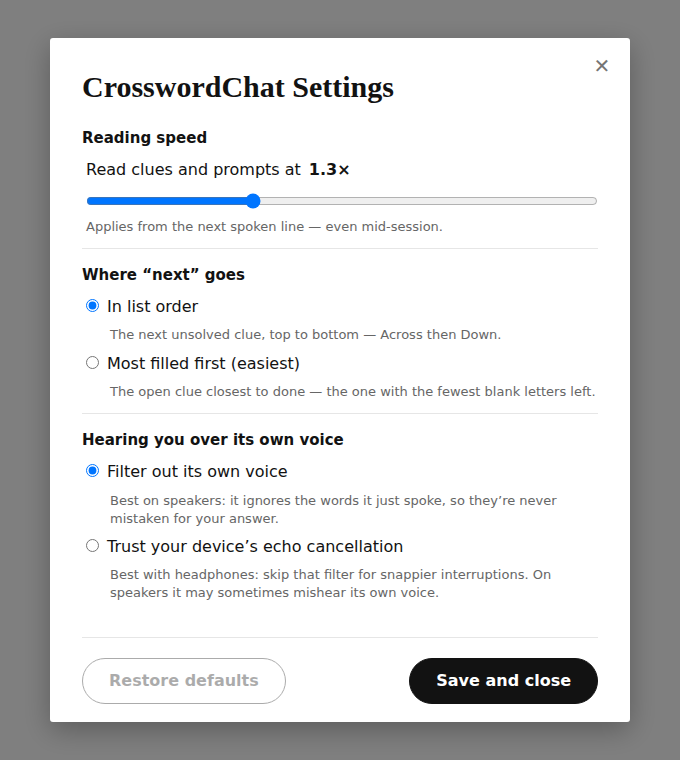
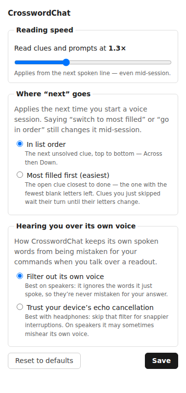
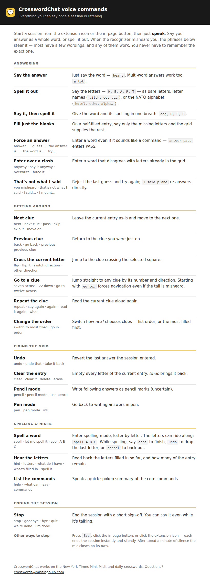
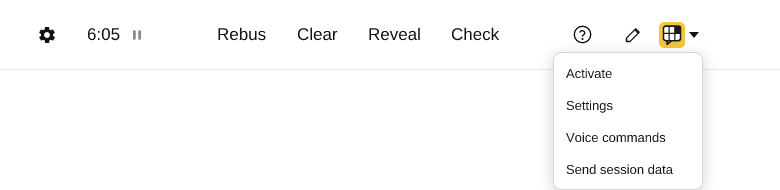

# CrosswordChat — Requirements

**Product:** Chrome extension (Manifest V3) that lets a user solve the New York Times crossword
conversationally: the extension reads clues aloud, the user answers by voice, the extension checks
the answer against the grid, enters it, and moves on.

**Status of this document:** Source of truth. Every requirement below carries a stable ID
(`REQ-<AREA>-<NNN>`). This document is *executable*: the traceability tool (`npm run trace`)
fails the build unless every requirement with `Status: Active` is referenced by at least one
automated test (in `extension-test/**/*.test.js`) or one manual test (in `dev/docs/MANUAL-TESTS.md`).
See [§14 Executable requirements schema](#14-executable-requirements-schema).

Keywords **MUST** / **SHOULD** / **MAY** are used per RFC 2119.

---

## 1. Glossary

| Term | Meaning |
|---|---|
| **Puzzle** | The NYT crossword grid + clues on a `nytimes.com/crosswords/game/...` page (daily or Mini). |
| **Clue** | What NYT calls a clue; the user may call it a "definition". E.g. *17 Across: Little house*. |
| **Entry** | The sequence of grid cells a clue's answer occupies. |
| **Entry length** | Number of cells in the entry (= number of letters, ignoring rebus). |
| **Pattern** | The current per-cell contents of an entry, e.g. `H _ _ R T` (filled letters + blanks). |
| **Crossing** | The perpendicular clue that shares a given cell with the current entry. |
| **Collision** | A candidate answer letter that disagrees with a letter already in the grid at that cell. |
| **Session** | An active conversation, started/stopped by clicking the extension icon or the in-page toolbar button (REQ-LIFE-012). |
| **Filled** | Every cell of an entry (or the grid) contains a letter. Filled ≠ correct. |
| **Solved** | NYT itself confirms the puzzle is correctly completed (congratulations modal). |
| **Homophone set** | Words pronounced (near-)identically with different spellings: *plain/plane*, *ate/eight*. The user says "homonyms"; we implement homophones. |
| **Utterance** | One chunk of recognized speech, delivered as an n-best list of alternative transcripts. |
| **Command** | An utterance that controls the conversation (*next*, *hint*, *repeat*, ...) rather than answering. |
| **Pencil mode** | NYT's "not sure" marker: letters typed with the toolbar pencil toggle on render grayed, signalling uncertainty. A *penciled* letter is one in that state. |
| **Malformed entry** | An entry that lost one or more of its letters to an overriding answer (REQ-ANS-012/016) — what remains no longer reads as the word it was. |

## 2. Scope & assumptions

- **In scope (MVP):** NYT Daily crossword and the Mini, on desktop Chrome (≥ 116), English (`en-US`),
  one puzzle tab at a time. Voice-only interaction — the extension shows no visual UI beyond a
  single start/stop button placed in the puzzle toolbar (REQ-LIFE-012); what was said/heard is
  mirrored to the page console for debugging (REQ-SPCH-007/008).
- **Out of scope (MVP), analyzed in §13:** rebus squares, NYT Check/Reveal integration, following
  cross-references, multiple simultaneous sessions, non-English puzzles, acrostics/other game types.
  (Barge-in — answering and commanding mid-readout — IS in scope: REQ-SPCH-009/REQ-CMD-006.)
- **Assumptions:**
  - The user is logged in to NYT with whatever subscription the puzzle needs; we piggyback on the
    already-rendered page and never call NYT APIs ourselves.
  - The NYT page DOM is subject to change without notice. All DOM specifics are quarantined in one
    module and are verifiable in one click via a *selector probe* (REQ-PAGE-009, MT-01).
  - Letters are A–Z only. NYT answers never contain spaces/hyphens (they are stripped by convention).

## 3. Architecture constraints (why the code is split the way it is)

The problem decomposes into independently testable modules (see `dev/docs/ARCHITECTURE.md`):

| Concern | Module | Depends on the NYT page? | Test style |
|---|---|---|---|
| Talk to the live page (read DOM, click, type) | `extension/src/page-adapter/` | **Yes — only place allowed to** | jsdom integration vs. a faithful fake NYT page + live-page manual probe |
| Interpret raw page data as a crossword | `extension/src/puzzle-model/` | No | unit |
| Decide what to do/say next | `extension/src/conversation/` | No | unit (pure state machine) |
| Turn intent into English (and clues into speech text) | `extension/src/conversation/phrases.js` | No | unit |
| Match utterances to answers (homophones, lengths, collisions) | `extension/src/matching/` | No | unit |
| Speech I/O (TTS/STT wrappers) | `extension/src/speech/` | No (browser APIs) | unit with fake browser APIs + manual |
| Wiring, lifecycle | `extension/src/background/`, `content/`, `app/` | Chrome APIs | manual + thin by design |

---

## 4. Puzzle model (MODEL)

The model is the pure, in-memory representation built from a page snapshot. Everything downstream
(matching, conversation) trusts it, so it gets its own requirements.

#### REQ-MODEL-001 — Numbering and clue↔cell mapping
- **Status:** Active · **Level:** MUST
- The model MUST derive standard crossword numbering from the grid geometry (a cell is numbered iff
  it starts an across entry — left edge or block to its left, with ≥2 open cells rightward — or
  similarly a down entry), MUST map every clue (`number` + `direction`) to its ordered cell indices,
  and MUST agree with the numbers rendered in the page DOM.
- Cases: grids with no blocks (Mini), blocks mid-row, entries of length ≥ 2 only (a 1-cell slot is
  not an entry).
- **Accept:** Given the 5×5 fixture and a 4×4 fixture with blocks, when the model is built, then every
  clue's cell list and number match the hand-computed expectation.
- **Verify:** unit `extension-test/unit/model.test.js`; manual MT-01 (live-page cross-check via probe).

#### REQ-MODEL-002 — Crossings
- **Status:** Active · **Level:** MUST
- For any position in an entry, the model MUST identify the crossing clue (id + human label such as
  *3 Down*) or `null` for uncrossed cells.
- **Accept:** Given the fixtures, when crossings are queried for known positions, then the expected
  clue labels are returned.
- **Verify:** unit `extension-test/unit/model.test.js`.

#### REQ-MODEL-003 — Pattern and progress
- **Status:** Active · **Level:** MUST
- The model MUST expose, per clue: the pattern (array of letter-or-null in entry order) and progress
  (`filled` / `length`). Empty cells are `null`, never `""` or space.
- **Accept:** Given a partially filled fixture grid, when pattern/progress are read, then they match
  the grid exactly.
- **Verify:** unit `extension-test/unit/model.test.js`.

#### REQ-MODEL-004 — Filled vs. solved are distinct
- **Status:** Active · **Level:** MUST
- The model MUST distinguish *grid full* (every non-block cell has a letter) from *solved* (the page
  reported success). A full grid MUST NOT be treated as solved (letters may be wrong).
- **Accept:** Given a full-but-unconfirmed snapshot, then `isFull() === true` and `isSolved() === false`;
  given a snapshot with the success signal, then `isSolved() === true`.
- **Verify:** unit `extension-test/unit/model.test.js`.

#### REQ-MODEL-005 — Canonical clue order
- **Status:** Active · **Level:** MUST
- The model MUST expose the NYT list order: all Across clues by ascending number, then all Down
  clues by ascending number.
- **Accept:** Given the fixtures, then `orderedClueIds` equals the expected sequence.
- **Verify:** unit `extension-test/unit/model.test.js`.

---

## 5. Session lifecycle (LIFE)

#### REQ-LIFE-001 — Start on icon click
- **Status:** Active · **Level:** MUST
- Clicking the extension icon on a NYT crossword page with an unsolved puzzle MUST start a session
  hosted in that page: snapshot the puzzle and read the first clue (per REQ-LIFE-007). Nothing
  visual may open — no panel, popup, or window; the only chrome is the action badge. The in-page
  toolbar button (REQ-LIFE-012) is an equivalent start control.
- **Accept:** Given an unsolved puzzle page, when the icon is clicked, then within the latency budget
  (REQ-NFR-003) the current clue is spoken and the mic starts listening.
- **Verify:** unit `extension-test/unit/machine.test.js` (START event → clue readout → listen); manual MT-03.

#### REQ-LIFE-002 — Icon click ends an active session immediately
- **Status:** Active · **Level:** MUST
- Clicking the icon during a session MUST end it: speech output stops mid-word, the mic stops,
  the badge clears. No goodbye message (the user asked for silence). Target ≤ 500 ms to silence.
  The in-page toolbar button (REQ-LIFE-012) ends a session the same way.
- **Accept:** Given a session mid-readout, when the icon is clicked, then audio stops and the mic
  indicator disappears.
- **Verify:** unit `extension-test/unit/machine.test.js` (TOGGLE_OFF → END with no SAY); manual MT-04.

#### REQ-LIFE-003 — Clicking where there is no puzzle
- **Status:** Active · **Level:** MUST
- On a page outside the supported URL set (REQ-LIFE-013) the icon click MUST open the
  unsupported-site popup (REQ-LIFE-014) and MUST NOT start a session. On a supported puzzle URL
  whose page has no detectable grid, the extension MUST say so briefly by voice ("I don't see a
  crossword here") and end. Safety net: if a supported-looking NYT page has no content script to
  host the session, the service worker speaks the same message via `chrome.tts` and flashes the
  badge.
- Cases: nytimes.com article page (popup); chrome:// pages (popup); crossword archive/landing
  page (popup — unsupported URL); supported game URL whose grid fails to parse (voice).
- **Accept:** As above for each case.
- **Verify:** unit `extension-test/unit/machine.test.js` (START with status `not-found`); manual MT-12.

#### REQ-LIFE-004 — Puzzle already solved at start
- **Status:** Active · **Level:** MUST
- If the snapshot at session start reports solved, the session MUST announce it cheerfully
  ("This one's already solved — hooray!") and end without listening.
- **Accept:** Given a solved puzzle, when a session starts, then exactly one celebratory utterance is
  spoken and the session ends (no LISTEN action ever issued).
- **Verify:** unit `extension-test/unit/machine.test.js`; manual MT-08.

#### REQ-LIFE-005 — Puzzle becomes solved mid-session
- **Status:** Active · **Level:** MUST
- When the puzzle transitions to solved during a session — whether because of an answer we entered
  or the user typing manually — the session MUST celebrate ("Hooray, solved it!") and end.
  NYT rules on a just-completed grid asynchronously and announces the ruling with a POPUP —
  congrats, or "Keep trying" when something's off — a beat AFTER the last letter. An entry that
  fills the grid MUST therefore wait for the page's verdict popup and react to whichever shows
  (not guess on a timer — user feedback 2026-07): congrats → celebration only; "Keep trying" →
  the REQ-LIFE-006 flow, with the popup clicked away so the board is usable again. A bounded
  safety timeout (~8 s) covers page variants that never pop anything: it falls back to the
  honest full-but-wrong coaching. A win must never be announced as an error first.
- **Accept:** Given a session, when the solved signal arrives (via entry result or page event), then
  the celebration is spoken and the session ends; given the winning entry's snapshot still says
  "active" but the congrats popup arrives a beat later, then ONLY the celebration is spoken.
- **Verify:** unit `extension-test/unit/machine.test.js`, `extension-test/unit/orchestrator.test.js` (verdict
  popups); manual MT-06.

#### REQ-LIFE-006 — Grid full but not solved
- **Status:** Active · **Level:** MUST
- If every cell is filled and the page ruled the grid wrong (its "Keep trying"-style popup, or
  the REQ-LIFE-005 safety timeout with no ruling at all), the session MUST say so ("The grid is
  full, but something's not right yet"), dismiss the ruling popup so the board is interactive
  again, and keep the conversation alive so the user can revisit entries (navigation + replace
  flows still work). It
  MUST NOT claim which letters are wrong (we don't know) and MUST NOT celebrate. The discrepancy
  message plays when the grid fills (and at a full-grid session start) and is NOT repeated: on a
  full grid, *next* MUST actually move — through the penciled entries when any exist
  (REQ-NAV-014), else forward through the filled clues in list order — never loop the same prompt
  back. When penciled letters exist, the fill moment itself also jumps straight to a penciled
  entry (REQ-NAV-014).
- **Accept:** Given a full-but-wrong grid after an entry with nothing penciled, then the
  discrepancy message is spoken and the session continues listening on the current clue; when the
  user then says "next" repeatedly, each filled clue is read in turn and the discrepancy message
  never replays.
- **Verify:** unit `extension-test/unit/machine.test.js`, `extension-test/unit/orchestrator.test.js`; manual MT-09.

#### REQ-LIFE-007 — First clue read = currently highlighted clue
- **Status:** Active · **Level:** MUST
- The first clue read MUST be the one highlighted on the page at session start. If none can be
  determined, fall back to the first not-fully-filled clue in list order; if all are filled, follow
  REQ-LIFE-006's flow starting at the first clue.
- **Accept:** Given 3 Down is selected on the page, when the session starts, then 3 Down is read first.
- **Verify:** unit `extension-test/unit/machine.test.js`; manual MT-03.

#### REQ-LIFE-008 — Page disappears mid-session
- **Status:** Active · **Level:** MUST
- If the puzzle tab navigates away, reloads, or closes during a session, the session MUST end and
  stop all audio within ~2 s. No retries against a dead page. (The session lives *in* the page, so
  page death ends it inherently; the service worker notices the port drop, silences any in-flight
  `chrome.tts` utterance, and clears the badge.)
- **Accept:** Given a session, when the tab is closed or navigated, then speech/mic stop and the
  badge clears.
- **Verify:** manual MT-19.

#### REQ-LIFE-009 — One session at a time
- **Status:** Active · **Level:** MUST
- At most one session may exist. Clicking the icon on a second crossword tab while a session runs
  elsewhere MUST end the first session and start on the new tab.
- **Accept:** Given a session on tab A, when the icon is clicked on tab B, then A's session ends and
  B's starts.
- **Verify:** manual MT-17.

#### REQ-LIFE-010 — Minimal preamble
- **Status:** Active · **Level:** MUST
- Session start MUST NOT lecture. At most a two-or-three-word greeting glued straight onto the
  first clue readout ("Let's solve. <clue text>..." — no clue label, REQ-READ-001).
  Discoverability comes from the *help* command (REQ-CMD-002), not a tutorial.
- **Accept:** Given session start, then exactly one SAY action is produced and it is the clue readout
  (with greeting folded in).
- **Verify:** unit `extension-test/unit/machine.test.js`.

#### REQ-LIFE-011 — Looking away ends the session
- **Status:** Active · **Level:** MUST
- The microphone never stays open on a puzzle the user is not looking at: the session MUST end
  when the user switches to another tab, another Chrome window, or another app. This is NOT
  tracked by watching tab/window focus in the background — instead the extension piggybacks on
  NYT, which pauses the puzzle whenever it loses visibility or window focus (verified live: the
  same "Your puzzle is paused" veil as the ~30 s idle pause). The in-page watcher sees that pause
  and ends the session via REQ-LIFE-017's pause path (a tiny blip, then teardown), so one signal
  — NYT's pause — covers both looking away and going idle. The end is otherwise silent (no spoken
  goodbye) and the badge clears.
- **Accept:** Given a running session, when the user switches to another tab or to a different
  app, then NYT pauses, and speech and mic stop within ~1–2 s with no spoken goodbye and the badge
  clears.
- **Verify:** manual MT-24.

#### REQ-LIFE-012 — On-page split button in the puzzle toolbar
- **Status:** Active · **Level:** MUST
- The content script MUST place a start/stop control inside the puzzle page itself: at the right
  end of NYT's toolbar — so the feature is discoverable where the solving happens (the extension
  icon remains an equivalent control). It is a **split
  button**: a main half that toggles the session, and a small caret that opens a menu with
  **Activate** (the same toggle), **Settings** (REQ-NAV-012), and **Voice commands** (the command
  reference, REQ-CMD-007). The menu opens on the caret, closes on choosing an item or on any click
  outside (or Escape), and the Activate row tracks session state (Activate ↔ Stop session).
  Settings and Help open extension pages, which a content script cannot do itself, so the button
  asks the service worker (REQ-CMD-007). The main half MUST wear the extension's own icon — the
  gold crossword-grid speech bubble, one mark everywhere: page button, action icon, store assets
  (the artwork lives in a single shared module so they cannot drift) — carry an accessible label,
  and MUST reflect session state (`aria-pressed`; while a session runs the tile inverts: ink tile,
  gold bubble). Clicking the main half MUST behave exactly like the extension icon: no session →
  start one (REQ-LIFE-001); a session running in this tab → end it instantly and silently
  (REQ-LIFE-002). Sessions started from the button obey one-session-at-a-time (REQ-LIFE-009).
  Placement MUST be at the right end of the toolbar's tool row (appended as its last child) — one
  fixed location, no pencil-relative anchoring and no over-the-page floating fallback; when no
  toolbar is present the on-page button is simply not shown (the extension icon still works).
  Because the NYT app renders after the content script loads — and can sit behind the pre-puzzle
  splash for minutes — injection MUST wait with an observer that disconnects once the button is
  placed, and MUST keep waiting as long as the page carries crossword app markup; only pages with
  no app markup at all (archive pages, section fronts) may give up after the timeout: no button,
  no errors, the extension icon still works. The injected SVG MUST survive a hostile host page (no
  url(#…) references; paints duplicated into inline styles). The injection lives in the page
  adapter (REQ-PAGE-011 — it is NYT DOM knowledge).
- **Accept:** Given a puzzle page, then exactly one labeled split button sits at the right end of
  the toolbar's tool row, clicking its main half starts a session and clicking again ends it, with
  `aria-pressed` tracking; given the caret is clicked, then a menu of Activate/Settings/Voice
  commands opens and choosing one closes it; given a toolbar that renders late — even after the
  give-up interval, while app markup is present — then the button appears once the toolbar does;
  given a page with no crossword markup (or no toolbar), then no button is injected and nothing
  throws.
- **Verify:** integration `extension-test/integration/session-button.test.js`; UI goldens
  `dev/requirements/ui/` (visual-snapshots — the mark and the injected toolbar button); manual MT-30.

<!-- ui-gallery:REQ-LIFE-012 -->

_UI goldens — generated from the shipped code by `npm run refresh:ui`:_

<strong>Extension button — active (ink tile, session running)</strong><br>


<strong>Extension button — idle (gold tile)</strong><br>


<strong>Injected session button in the NYT toolbar — active (session running)</strong><br>


<strong>Injected session button in the NYT toolbar — idle</strong><br>


<!-- /ui-gallery:REQ-LIFE-012 -->

#### REQ-LIFE-013 — Action icon signals supported pages
- **Status:** Active · **Level:** MUST
- The extension's toolbar (action) icon MUST look different on supported puzzle pages than
  everywhere else, so the user can tell at a glance where CrosswordChat works. Supported = tab
  URL starting `https://www.nytimes.com/crosswords/game/mini`, `.../midi`, or `.../daily`
  (plus the localhost dev fixture, `http://localhost:8787/`): full-color icon. Anywhere else:
  a grayed-out variant. The check is URL-only (no page inspection — the icon must be right even
  before the page loads), and the icon MUST track tab navigation and tab switches.
- **Accept:** Given a Mini/Midi/Daily tab, then the colored icon shows; given an NYT article page
  or any non-NYT tab, then the gray icon shows; navigating one tab between the two updates it.
- **Verify:** unit `extension-test/unit/urls.test.js` (supported-URL matcher); manual MT-31.

#### REQ-LIFE-014 — Unsupported-site popup
- **Status:** Active · **Level:** MUST
- On tabs outside the supported URL set (REQ-LIFE-013), clicking the action icon MUST open a
  small popup instead of silently doing nothing: it says CrosswordChat is not supported on this
  site, names where it works (the NYT Mini, Midi and daily crosswords), and — for pages that DO
  show a crossword we don't cover yet — invites a support request at `crosswords@missingbulb.com`
  (mailto link). On supported tabs there MUST be no popup: the click goes straight to
  start/stop (REQ-LIFE-001/002). The popup is set per tab (`chrome.action.setPopup`), tracked
  together with the icon variant (REQ-LIFE-013), and is pure static HTML — no scripts, no
  network, nothing read from the page (REQ-NFR-001/002 apply).
- **Accept:** Given a non-supported tab, when the icon is clicked, then the popup opens showing
  the unsupported message and the support address; given a supported puzzle tab, then no popup
  opens and the session toggles.
- **Verify:** manual MT-31.

#### REQ-LIFE-015 — Escape ends the session
- **Status:** Active · **Level:** MUST
- Pressing the Escape key during a session MUST end it exactly like the toggle: instantly and
  silently (REQ-LIFE-002). Only trusted key events count (`event.isTrusted`) — the extension's
  own synthetic keystrokes, or the page's, can never end a session. During a session the key is
  OURS: the capture-phase listener stops propagation and default handling, so NYT's own Escape
  binding (it opens the rebus entry box) MUST NOT fire alongside the teardown. The listener is
  session-scoped: added when a session starts, removed when it ends (REQ-NFR-004 inertness) —
  outside a session Escape reaches NYT untouched.
- **Accept:** Given a running session, when the user presses Escape, then speech and mic stop
  immediately, the button/badge show off, and NO rebus box opens; given no session, then Escape
  does nothing of ours (NYT's rebus binding works normally).
- **Verify:** manual MT-33 (the listener wiring is content-script glue; the teardown path it
  invokes is REQ-LIFE-002's).

#### REQ-LIFE-016 — The pre-puzzle splash screen
- **Status:** Active · **Level:** MUST
- Starting a session while the puzzle still sits behind its splash ("Ready to start solving?"
  with a Play button) MUST NOT dead-end. Best effort, in order: (1) find the splash's Play-ish
  button and click it like a user would; (2) if the splash stays (a page that honors only trusted
  clicks), say by voice that the user should click Play, keep waiting, and start the conversation
  the moment the splash clears; (3) if it never clears (~60 s), end quietly. Splash detection is
  page-adapter knowledge (REQ-PAGE-011) and MUST degrade to "no splash" on pages without one.
  Detection MUST be belt and braces (the class family drifted out from under the xwd__ nets —
  v0.11.2 user report): the live splash is the games shell's `pz-moment` family (VERIFIED via a
  user capture, 2026-07-05 — headline in `pz-moment__description`; the Play button's classes are
  build-hashed CSS-module names, so the button MUST be matched by its text/aria name, the only
  stable hook), the legacy `xwd__` modal shapes stay netted, and a text anchor on the "Ready to
  start solving" headline catches the next rename; only VISIBLE splashes count (a moment hidden
  with `display:none` reads as cleared). The probe (MT-01) reports a `splash` line, plus a
  failing `splash text without button` line when the headline is rendered but no button was
  found — the exact v0.11.2 failure mode.
- **Accept:** Given the fake page with a splash, then Play is clicked and the session proceeds;
  given a splash that ignores synthetic clicks, then the prompt is spoken and the session starts
  once the splash is cleared by hand.
- **Verify:** integration `extension-test/integration/splash.test.js`; manual MT-33.

#### REQ-LIFE-017 — Keep the puzzle alive so it never auto-pauses mid-conversation
- **Status:** Active · **Level:** MUST
- The NYT games shell auto-pauses a puzzle ~30 s after the last keyboard input (verified live: it
  dispatches `crossword/timer/PAUSE_TIMER` and veils the board with "Your puzzle is paused"; a
  keydown resets that timer). This is a THINKING game driven by voice — the user isn't typing —
  so two things MUST happen:
  1. **User commands keep the puzzle alive.** On every heard user command the extension sends the
     page a keep-alive keystroke (a bare modifier keydown/keyup that types no letter and moves no
     cursor) so NYT's inactivity timer resets. There is NO background heartbeat — presence is
     driven only by the conversation. (Page writes — entering an answer — also type real keys and
     so keep it alive on their own.)
  2. **When NYT does pause, the session ends.** If the user goes quiet (no command for ~30 s) the
     puzzle pauses; the in-page watcher detects the "Your puzzle is paused" veil and ends the
     session, playing one tiny descending blip so the user knows why it went silent. The veiled,
     letter-less grid MUST NOT be read as the user clearing the grid — pause is detected before
     the change diff, and reported at most once per veil. This same pause path is what ends the
     session on tab/window switch (REQ-LIFE-011): NYT pauses on look-away too, and we piggyback on
     that rather than tracking focus ourselves.
- **Accept:** Given the fake page's inactivity model, a quiet puzzle auto-pauses when its timer
  fires; a keep-alive keystroke (or a heard command) before the timer keeps it live and changes
  neither the grid nor the selection; and when the veil appears the watcher reports `paused` once
  and the session ends with the blip.
- **Verify:** integration `extension-test/integration/page-adapter.test.js` (keepAlive,
  isPaused, and the watcher's `paused` event); unit `extension-test/unit/orchestrator.test.js`
  (command keeps alive; pause ends with the blip).

---

## 6. Clue readout (READ)

The NYT clue text is rich: italics, brackets, quotes, blanks (`___`), question marks, HTML
entities. The readout must convey what the eye would see.

**Readout grammar (normative):**

```
[Greeting] <spoken clue text>.
[<formatting annotations>]
```

#### REQ-READ-001 — Readout structure
- **Status:** Active · **Level:** MUST
- Every clue readout MUST contain, in order: the clue text, then any formatting annotations
  (REQ-READ-002/003/006) — and nothing else. The clue label ("17 Across") MUST NOT be spoken —
  the page highlight already shows position (REQ-NAV-007) — and neither is the letter count
  (REQ-READ-008, retired): the readout gets straight to the clue.
- **Accept:** Given clue 1A "Organ with four chambers", then the readout is
  "Organ with four chambers." (modulo greeting) — no "1 Across" preamble, no "5 letters." tail.
- **Verify:** unit `extension-test/unit/verbalizer.test.js`.

#### REQ-READ-002 — Italics are announced
- **Status:** Active · **Level:** MUST
- If part of the clue is italic (`<i>`/`<em>` in NYT HTML), the readout MUST read the clue text
  normally, then append: single word → `The word 'X' is in italics.`; multi-word span →
  `The phrase 'X Y' is in italics.`; whole clue italic → `The whole clue is in italics.`
  Multiple italic spans are each announced.
- Rationale: italics distinguish e.g. titles (*Little House*) from plain words — meaning-bearing.
- **Accept:** Given clue HTML `Little <i>house</i>`, then the readout contains
  "Little house. The word 'house' is in italics."
- **Verify:** unit `extension-test/unit/verbalizer.test.js`, `extension-test/unit/clue-html.test.js`.

#### REQ-READ-003 — Bracketed clues are announced
- **Status:** Active · **Level:** MUST
- If the entire clue is wrapped in square brackets (NYT convention for non-verbal utterances,
  e.g. `[Sigh]`), the readout MUST say `The clue is in brackets:` and then the inner text (brackets
  themselves are not read as punctuation).
- Case: brackets *inside* a clue (e.g. `Word after "boo" [not "hoo"]`) → read text as-is; only
  whole-clue brackets get the announcement (partial brackets are rare editorial asides).
- **Accept:** Given clue `[Treat badly]`, then readout contains "The clue is in brackets: Treat badly."
- **Verify:** unit `extension-test/unit/verbalizer.test.js`.

#### REQ-READ-004 — Question-mark clues
- **Status:** Active · **Level:** MUST
- A trailing `?` (NYT signal for wordplay) MUST be conveyed twice: (a) the `?` is kept in the text
  handed to TTS so capable voices apply question intonation, and (b) the phrase `Question mark.` is
  appended as an explicit annotation (default ON, configurable constant), because intonation alone
  is unreliable across voices and the `?` is semantically load-bearing in crosswords.
- **Accept:** Given clue `It might go viral?`, then the spoken text ends with `viral?` and contains
  the annotation "Question mark."
- **Verify:** unit `extension-test/unit/verbalizer.test.js`; manual MT-14 (listen check).

#### REQ-READ-005 — Blanks (`___`) are read as "blank"
- **Status:** Active · **Level:** MUST
- Every run of ≥ 2 underscores MUST be spoken as the word `blank`. (TTS engines otherwise skip it
  or read "underscore underscore...".)
- **Accept:** Given clue `"The ___ of the Matter"`, then the spoken text contains `The blank of the Matter`.
- **Verify:** unit `extension-test/unit/verbalizer.test.js`.

#### REQ-READ-006 — Quoted text is announced (whole clue only)
- **Status:** Active · **Level:** SHOULD
- If the WHOLE clue is quoted (straight or curly double quotes), append annotation
  `The clue is in quotes.` (a fully quoted clue signals a spoken phrase/title —
  meaning-bearing, same rationale as italics). Partial quoted spans get NO annotation:
  they are too common to be worth the airtime (user feedback — the annotation was
  dropped).
- **Accept:** Given `"Hooray!"`, then annotation "The clue is in quotes." is present;
  given `Word after "boo", often`, then no quotes annotation at all.
- **Verify:** unit `extension-test/unit/verbalizer.test.js`.

#### REQ-READ-007 — HTML entities are decoded
- **Status:** Active · **Level:** MUST
- Clue HTML entities (`&amp;`, `&quot;`, `&#39;`, `&ldquo;`, `&eacute;`, numeric forms, ...) MUST be
  decoded to their characters before speaking, and unknown tags (`<b>`, `<sub>`, ...) MUST be
  stripped while keeping their text.
- **Accept:** Given `Tom &amp; Jerry`, then the spoken text is `Tom & Jerry` (TTS reads "and").
- **Verify:** unit `extension-test/unit/clue-html.test.js`.

#### REQ-READ-008 — Letter count is spoken last
- **Status:** Retired · **Level:** —
- Retired (2026-07, user feedback): the readout no longer announces the entry length at all —
  every clue got a "N letters." tail that added latency without helping most answers. The user
  finds the length out exactly when it matters: a length-mismatch report (REQ-ANS-007), the hint
  command (REQ-HINT-002), or spelling (REQ-ANS-011/018) all still name counts. (While it was
  active: every readout ended with `<N> letters.`, the count being the number of cells.)
- **Accept:** Given any clue readout, then no letter count is spoken anywhere in it.
- **Verify:** unit `extension-test/unit/verbalizer.test.js`.

#### REQ-READ-009 — Repeat
- **Status:** Active · **Level:** MUST
- The command *repeat* (synonyms in REQ-CMD-001) MUST re-read the current clue readout in full
  (without greeting), then listen again.
- **Accept:** Given a session listening on 3 Down, when the user says "repeat", then 3 Down's readout
  is spoken again.
- **Verify:** unit `extension-test/unit/machine.test.js`; manual MT-16.

#### REQ-READ-010 — Cross-reference clues are read literally
- **Status:** Active · **Level:** MUST (literal reading); following the reference is REQ-FUT-004
- Clues like `See 17-Across` or `With 5-Down, ...` MUST be read as-is. The MVP does not navigate to
  the referenced clue automatically.
- **Accept:** Given clue `See 17-Across`, then the spoken text is exactly that.
- **Verify:** unit `extension-test/unit/verbalizer.test.js`.

#### REQ-READ-011 — Editorial tags are read literally
- **Status:** Active · **Level:** MUST
- Suffix tags such as `: Abbr.`, `, for short`, `, e.g.`, `, in brief` MUST be preserved verbatim in
  the spoken text (they tell the solver the answer form). No expansion, no omission.
- **Accept:** Given `Violinist's supply: Abbr.`, then the spoken text contains `: Abbr.` read as-is.
- **Verify:** unit `extension-test/unit/verbalizer.test.js`.

**Formatting decision table (spoken output for clue variants):**

| Clue source (HTML) | Spoken text | Annotations |
|---|---|---|
| `Organ with four chambers` | same | — |
| `Little <i>house</i>` | `Little house.` | `The word 'house' is in italics.` |
| `<i>Little house</i>` | `Little house.` | `The whole clue is in italics.` |
| `[Treat badly]` | `Treat badly.` | `The clue is in brackets:` (prefix) |
| `It might go viral?` | `It might go viral?` | `Question mark.` |
| `&ldquo;The ___ of the Matter&rdquo;` | `"The blank of the Matter"` | `The clue is in quotes.` |
| `See 17-Across` | `See 17-Across.` | — |
| `Sticky stuff: Abbr.` | `Sticky stuff: Abbr.` | — |

---

## 7. Navigation between clues (NAV)

#### REQ-NAV-001 — "next"/"pass" advances without entering anything
- **Status:** Active · **Level:** MUST
- The commands *next*, *pass*, *skip* (full lexicon REQ-CMD-001) MUST leave the current entry
  untouched, advance to the next clue per the active strategy, sync the page highlight, and read
  the new clue.
- **Accept:** Given listening on 1 Across, when the user says "pass", then no letters change and
  the next clue is read.
- **Verify:** unit `extension-test/unit/machine.test.js`; manual MT-06.

#### REQ-NAV-002 — Default strategy: list order
- **Status:** Active · **Level:** MUST
- The default strategy MUST be NYT list order (REQ-MODEL-005) starting after the current clue,
  wrapping from the last Down back to the first Across.
- **Accept:** Given current = last Down with earlier clues unfilled, when advancing, then the first
  unfilled Across is chosen.
- **Verify:** unit `extension-test/unit/strategies.test.js`.

#### REQ-NAV-003 — Fully filled clues are skipped when advancing
- **Status:** Active · **Level:** MUST
- Advancing MUST skip entries that are already completely filled (their letters may still be edited
  via the replace flow, but we don't offer them proactively). If *no* unfilled clue exists, stay on
  the current clue (REQ-LIFE-006 covers the announcement).
- **Accept:** Given the next two clues in order are filled, when advancing, then the third is selected.
- **Verify:** unit `extension-test/unit/strategies.test.js`, `extension-test/unit/machine.test.js`.

#### REQ-NAV-004 — Strategy: most-filled-first (easiest = fewest open letters, closest to done)
- **Status:** Active · **Level:** MUST
- A second strategy MUST rank unfilled clues by *how many* letters they still have OPEN (blank),
  FEWEST first — the entry closest to being finished is offered first — with a penciled cell
  counting as HALF-open: pencil marks are the solver's own "not sure" notes (REQ-ANS-023), real
  progress but shaky, so a penciled cell is half-closed, not closed. Equal open counts break by
  one of two chains, chosen by whether the CURRENT entry holds a letter. When the current entry
  is completely BLANK (no letters at all), ties move to the next entry in the SAME direction by
  number, wrapping to the first — plain sequential movement, never a crossing jump: a blank entry
  anchors no area to build around, so "next" simply keeps going the way it was pointed (the next
  Down from a Down, the next Across from an Across); other-direction entries come up only when the
  same direction is dry. Otherwise (the current entry has ≥1 letter) ties break FIRST by CROSSING,
  then by DISTANCE. CROSSING: a clue that shares a cell with the current entry — one whose answer
  would fill a letter of the clue in front of the solver — is offered before an equally-close clue
  that does not cross it. DISTANCE (among clues of equal crossing status): the clue nearest the
  current one in list order wins (smallest jump — from clue 4, an equal clue 5 beats clue 6), a
  forward clue winning an exact-distance tie; remaining ties by list order, cycling through the
  current clue last. Both chains keep CLOSENESS first: a near-done entry is always offered ahead
  of the sequential/crossing/distance tiebreak. Rationale: "easiest first" should
  steer the solver to what they can finish NOW — the entry with the fewest gaps left — not the
  entry that merely holds the most letters. Ranking by letters ALREADY PLACED (the earlier rule)
  let a long entry with many blanks outrank a short one needing a single letter, so the long entry
  was suggested over and over while the near-finished one waited (user feedback 2026-07: fewest
  open letters beats most letters placed — a 2-of-3 entry, 1 gap, beats a 3-of-5 entry, 2 gaps).
  Among equals a crossing entry beats bare list-order distance because list-order proximity is a
  poor proxy for spatial nearness — 5 Down is adjacent to 4 Down by number yet need not touch it,
  while 10 Across may cross 4 Down cell-to-cell; the crossing entry is the one sitting where the
  solver is working, and finishing it unlocks a letter of the current answer (user feedback 2026-07).
  Once crossing status is equal, the smallest jump keeps the solver oriented. The blank-entry
  exception exists because crossing toward an entry the solver has not started reads as a random
  sideways jump — on a fresh grid there is no area being built, so sequential same-direction
  movement is what "next" is expected to do (user feedback 2026-07).
- **Accept:** Given a 2-of-3 entry (1 open) and a 3-of-5 entry (2 open), when advancing under
  most-filled, then the 2-of-3 entry is chosen — fewer gaps wins even though it holds fewer
  letters; given one entry with 4 penciled + 1 blank (open 3) and another with 3 pen + 2 blank
  (open 2), then the pen entry is chosen (shaky pencil leaves it more open). Given two unfilled
  entries equally close to done — one crossing the current STARTED clue (≥1 letter), one not —
  then the crossing entry is chosen even when the non-crossing one is nearer in list order. Given
  a completely BLANK current entry on an otherwise-open grid, "next" moves to the next entry in the
  same direction by number (the next Down from a Down, wrapping to the first Down past the last),
  never to a crossing entry — but closeness still overrides, so a near-done entry elsewhere is
  offered ahead of the sequential walk. Given equal open counts AND equal crossing status one and
  two steps ahead (a block-separated band of parallel entries whose current clue is started), then
  the one-step clue is chosen, forward winning an exact tie.
- **Verify:** unit `extension-test/unit/strategies.test.js`.

#### REQ-NAV-005 — Switching strategy by voice
- **Status:** Planned · **Level:** SHOULD
- Removed for now — voice control of settings is out of scope. The next-clue strategy is set only
  through the settings surface (REQ-NAV-012), never by voice. Kept as a tracked ID so voice switching
  can return. (Previously: saying *"switch to most filled"* / *"go in order"* switched the active
  strategy for the rest of the session and confirmed briefly.)

#### REQ-NAV-006 — Wrap-around is announced
- **Status:** Retired · **Level:** —
- Retired: wrapping past the end now happens silently. The "Back to the top." prefix added
  readout latency without aiding orientation — the page highlight (REQ-NAV-007) already shows
  where the conversation is. Could return as an opt-in setting if missed.
- **Accept:** Given a wrap, then the readout is the plain clue readout, no prefix.
- **Verify:** unit `extension-test/unit/machine.test.js`, `extension-test/unit/verbalizer.test.js`.

#### REQ-NAV-007 — Page highlight follows the conversation
- **Status:** Active · **Level:** MUST
- Whenever the conversation moves to a clue, the page selection MUST be updated (as if the user
  clicked that clue) so screen and audio agree.
- **Accept:** Given advancing to 4 Down, then the page shows 4 Down highlighted.
- **Verify:** integration `extension-test/integration/page-adapter.test.js` (navigator); unit
  `extension-test/unit/machine.test.js` (SELECT_CLUE action emitted); manual MT-06.

#### REQ-NAV-008 — Conversation follows manual selection
- **Status:** Active · **Level:** MUST
- If the user clicks a different clue/cell on the page during the session, the conversation MUST
  follow it immediately: abandon whatever it was doing (an in-flight readout is cut short;
  spelling/disambiguation/confirmation modes reset) and read the newly selected clue. Selection
  changes caused by our own writing/navigation MUST NOT trigger this (no echo loops). One
  exception: while an accepted answer is being confirmed and written (between "Fits!" and the
  letters landing), the click is NOT followed — following would silently discard the answer.
- Absorbed selection events — the clue we already track, or a click the machine won't follow —
  MUST leave the open mic alone: the shell only aborts the in-flight listen cycle for clicks it
  will follow (which re-open the mic after the readout). Stopping the mic for an absorbed event
  produced deaf sessions that still showed ON (mic-death bug).
- **Accept:** Given a session on 1A — listening, mid-readout, or in a sub-mode — when the page
  selection changes to 3D (user click), then 3D is read; when selection events arrive for the clue
  we already track, nothing happens AND the mic keeps listening; when several clicks land in quick
  succession (faster than readouts play), then only the LAST clicked clue is read — superseded
  clicks produce no readout.
- **Verify:** unit `extension-test/unit/machine.test.js`, `extension-test/unit/orchestrator.test.js` (rapid clicks);
  manual MT-13.

#### REQ-NAV-009 — "back" goes to the previous clue
- **Status:** Active · **Level:** MUST
- *back* / *go back* / *previous* MUST move to the previous clue, read it, and sync the page
  highlight. Under list order, "previous" is the previous clue in list order — wrapping from the
  first Across to the last Down. Under most-filled (REQ-NAV-004), *next* jumps around the grid,
  so list order would be a non sequitur: *back* MUST instead retrace the session's own trail —
  the clues actually visited, newest first, whether reached by next, flip, goto, the
  auto-advance after an answer, or a click. Going back never re-records the clue it leaves, so
  a chain of *back*s walks steadily backward instead of ping-ponging; once the trail runs dry,
  *back* falls back to list order. Unlike *next* (REQ-NAV-003), filled entries are NOT skipped
  in either mode: going back exists to revisit and fix what is already there.
- **Accept:** Given the current clue is 6 Across with 1 Across filled, when the user says "back",
  then 1 Across is selected and read; given the current clue is the first Across, then "back"
  lands on the last Down. Given most-filled took the session A4 → A2 → A1, when the user says
  "back" twice, then it lands on A2 and then A4; a third "back" uses list order.
- **Verify:** unit `extension-test/unit/machine.test.js`; manual MT-26.

#### REQ-NAV-010 — "flip" switches to the crossing clue at the selected square
- **Status:** Active · **Level:** MUST
- *flip* MUST switch from the current clue to the perpendicular clue that crosses it AT THE
  SELECTED CELL (the page highlight marks the square the user means — flipping from the entry's
  first letter instead was reported as wrong, 2026-07), read it, and sync the page highlight.
  When the selection is unknown or lies outside the current entry, the crossing at the entry's
  first crossed cell (REQ-MODEL-002) is the fallback. Flipping again returns to a clue in the
  original direction. When the entry has no crossing at all, say so briefly and keep listening.
- **Accept:** Given the current clue is 1 Across with the cursor on its third cell, when the user
  says "flip", then 3 Down (the crossing at THAT cell) is selected and read; with no cursor
  information, then 1 Down (the first crossed cell) is.
- **Verify:** unit `extension-test/unit/machine.test.js`; manual MT-26.

#### REQ-NAV-011 — Skip memory under most-filled
- **Status:** Active · **Level:** MUST
- Under the most-filled strategy, saying *next* MUST remember the clue it just left (together with
  its filled-letter count at that moment), and remembered clues MUST NOT be offered again while
  their letters are unchanged — so repeated *next* walks the open clues fewest-open first (closest
  to done first) instead of ping-ponging between the two nearest completion. A remembered clue
  becomes eligible again the moment its filled letters change (e.g. a crossing answer landed — its
  new open count may make it the best pick once more). When every open clue is
  remembered-and-unchanged, advancing MUST cycle back to the *least recently* skipped one rather
  than getting stuck. Skip memory is
  session-scoped; it does not constrain the list-order strategy (REQ-NAV-002), *back*
  (REQ-NAV-009), *flip* (REQ-NAV-010), or manual clicks (REQ-NAV-008).
- When *next* lands the user back on a clue they had skipped — the cycle-back once everything has
  been passed, or a skip made eligible again by a fresh crossing letter — the readout MUST announce
  the return (a short lead such as *"Back to this one."*) rather than reading the clue as if it were
  a brand-new suggestion. A silent re-offer read as "why has it put me back on the one I keep
  skipping?" (field feedback); naming it as a return makes the loop legible instead of confusing.
- **Accept:** Given four open entries with distinct open counts under most-filled, when the user
  says next four times, then the entries are visited fewest-open first with no repeats,
  and a fifth next returns to the first-skipped one *and is announced as a return*; given a skipped
  entry gains a letter from a crossing answer, then the following next offers it again; given a
  never-before-skipped clue is offered, then it is read plainly with no return lead.
- **Verify:** unit `extension-test/unit/strategies.test.js`, `extension-test/unit/machine.test.js`,
  `extension-test/unit/verbalizer.test.js`; manual MT-28.

#### REQ-NAV-012 — Default strategy is a persisted setting
- **Status:** Active · **Level:** MUST
- The extension MUST offer a settings surface — a popup anchored under the toolbar icon,
  reached by right-clicking the icon → *Settings…* (not Chrome's `options_ui`, which detours
  through chrome://extensions) — where the user picks between the two navigation modes (list
  order / most filled first). Edits are buffered: a *Save* button persists them and closes the
  popup, and a *Reset to defaults* button restores the defaults in the form without saving.
  The choice MUST persist in `chrome.storage.sync` and MUST be applied as the starting
  strategy of every new session. (Voice switching of the strategy is removed for now — REQ-NAV-005;
  the setting is the only way to change it.) A missing or invalid stored value falls back to list
  order (REQ-NAV-002).
- Both settings surfaces MUST also carry the echo-mode choice (`echoMode`, REQ-SPCH-005) — a
  persisted field with the same Save/Reset buffering, alongside the reading speed, the navigation
  mode, and the experimental biasing mode (REQ-SPCH-011).
- The in-page toolbar button's *Settings* item (REQ-CMD-007) MUST open the same settings — the
  reading speed (REQ-SPCH-001), navigation mode, echo mode (REQ-SPCH-005), and biasing mode
  (REQ-SPCH-011) — as a centred modal
  injected into the puzzle page, styled to mirror NYT's own *Puzzle Settings* popup (a card over a
  dimming overlay, a Karnak title, sectioned rows, and a primary *Save and close* / secondary
  *Restore defaults* pair). It
  reuses NYT's already-loaded webfonts by name with generic fallbacks, so it never fetches a font
  and still renders legibly where those fonts are absent. The same Save/Reset buffering applies;
  the ✕, the overlay, and Escape discard unsaved edits. The extension-icon route above is unchanged.

<!-- ui-gallery:REQ-NAV-012 -->

_UI goldens — generated from the shipped code by `npm run refresh:ui`:_

<strong>In-page Settings modal (NYT-styled) — default state</strong><br>


<strong>Settings popup (options.html) — default state</strong><br>


<!-- /ui-gallery:REQ-NAV-012 -->

- **Accept:** Given the stored setting is most-filled, when a session starts and the user says
  next, then the most-filled strategy picks the clue; given no stored value (or a corrupted one),
  then list order is used.
- **Verify:** unit `extension-test/unit/machine.test.js`, `extension-test/unit/settings.test.js`; UI
  golden `dev/requirements/ui/` (visual-snapshots — the settings popup); manual MT-28.

#### REQ-NAV-013 — Jump to a clue by its spoken label
- **Status:** Active · **Level:** MUST
- Saying a clue label — a number and a direction, e.g. *"seven across"*, *"22 down"*,
  *"go to twenty two across"* — MUST select that clue on the page and read it, exactly like
  clicking it. Numbers work as digits or number words (REQ-ANS-002 conventions). STT garbles
  these short utterances constantly (live report 2026-07: "5 down" always worked while
  "5/6/7/9 across" repeatedly failed), so the matcher MUST also accept: "a cross" and "cross"
  as renderings of *across*; ordinal forms of the number ("sixth across", "6th across"); and the
  frequent number homophones (won/to/for/sex/ate/nein…). When the direction was clearly *across*
  but the number still doesn't parse (the short number is what STT drops, not the direction word),
  the machine MUST NOT discard the understood direction: it holds that direction and asks for the
  number alone (*"Which number, going across?"*), and a bare number heard next completes the jump in
  the remembered direction — a lone number is far more reliably recognized than the whole label.
  This recovery is a minimal sub-mode (like spelling): a full label supersedes it, any ordinary
  command leaves it, and a reply carrying no usable number drops back to normal listening. When the
  puzzle has no such clue, reply that it doesn't exist and keep listening; bare utterances whose leading part is not a number and whose
  tail is not unambiguous navigation ("falling down", "red cross") are NOT gotos and stay available
  to the answer pipeline.
- **Explicit "go to" prefix.** *"go to …"* (and STT variants: *goto*, *go two*, *go 2*, *jump to*)
  is an unambiguous navigation intent: whatever follows is a clue label by construction, so the
  matcher MUST parse the tail as a label and MUST NOT fall through to the answer pipeline — even
  when the direction was garbled or dropped. A missing/garbled number OR a missing direction makes
  the machine ask for the label briefly ("I didn't catch which clue"), never enter an answer. This
  is what makes navigating to a definition robust when the listener mishears the tail.
- **Accept:** Given "six across" on a puzzle with a 6-Across, then 6-Across is selected and read;
  given "5 a cross" or "sixth across", then the jump still happens; given "twelve down" with no
  12-Down, then the reply says there is no 12 down; given "gibberish across", then the reply holds
  the across direction and asks for the number, and a following "six" jumps to 6-Across; given "go
  to six across", then 6-Across is selected; given "go to seven"
  (no direction), then the reply asks for the label instead of answering.
- **Verify:** unit `extension-test/unit/matching.test.js` (parsing), `extension-test/unit/machine.test.js` (jump +
  missing label + garbled number + directional recovery).

#### REQ-NAV-014 — A full grid patrols its penciled entries
- **Status:** Active · **Level:** MUST
- On a full-but-wrong grid (REQ-LIFE-006), the penciled letters are the prime suspects — they are
  the "not sure" marks (REQ-ANS-023/REQ-ANS-025). When the grid fills without solving (or a
  session starts on one) and any entry holds penciled letters, the session MUST land on a
  penciled entry immediately — the discrepancy message, then that entry's readout. And *next* on
  a full grid MUST cycle through the penciled entries only (in list order from the current clue,
  wrapping), falling back to all filled clues in list order when nothing is penciled. Pencils
  are seen two ways (REQ-ANS-023): the live rect marker (hand-penciled letters included,
  REQ-PAGE-012) and the session's own soft-cell ledger.
- **Accept:** Given an entry that fills the grid wrong while 3 Down holds a penciled letter, then
  the discrepancy message is followed by 3 Down's readout; when the user then says "next"
  repeatedly, then only entries holding penciled letters are visited, cycling.
- **Verify:** unit `extension-test/unit/machine.test.js`.

---

## 8. Answers: hearing, checking, entering (ANS)

This is the heart of the product. Speech recognition is *phonetic*; crossword answers are
*orthographic*. The matcher must bridge that gap.

**Evaluation pipeline (normative):** for each utterance —

1. Command check first (REQ-CMD-001, REQ-ANS-014). If a command matches, it wins.
2. For each STT alternative (n-best, REQ-ANS-004): tokenize; normalize digits/ordinals to words
   (REQ-ANS-002); expand token-level homophones (REQ-ANS-003); join tokens to a candidate word
   (REQ-ANS-001, REQ-ANS-015). The unexpanded join of the top alternative is the **literal**.
   An utterance that is spoken letters throughout (bare letters, letter names, NATO) also yields
   the joined letters as a candidate (REQ-ANS-020) — spelling without entering spelling mode.
   A word whose own spelling trails it ("dog, D, O, G") also yields that word alone
   (REQ-ANS-022) — never only the doubled-up join.
3. Keep candidates that are pure A–Z; drop candidates the user already rejected (REQ-ANS-010).
4. Gate by entry length (REQ-ANS-005). No length match → report per REQ-ANS-007.
5. Among length-fitting candidates, check the pattern. Exactly one pattern-fitting spelling from the
   best alternative → accept (REQ-ANS-006). Several homophone spellings fit → ask (REQ-ANS-009).
   None fit the pattern → report the collision for the best candidate (REQ-ANS-008).

**Worked examples (these exact cases are unit-tested):**

| Entry needs | Grid pattern | User says | STT hears | Outcome |
|---|---|---|---|---|
| 5 | `_____` | "heart" | `heart` | fits → enter HEART |
| 3 | `___` | "ate" | `8` | digit→EIGHT (5, no) → homophone ATE (3) → fits, spelled out loud |
| 5 | `_L___` | "plain" | `plain` | PLAIN and PLANE both fit pattern → disambiguate |
| 5 | `_R___` | "plain" | `plain` | only PLANE fits? no — PLAIN collides at 2 (`R`≠`L`)... see unit fixtures |
| 4 | `____` | "a lot" | `a lot` | join → ALOT (4) → fits |
| 6 | `______` | "ocelot" | `ocelot` | 6 → fits |
| 4 | `____` | "ocelot" | `ocelot` | 6 ≠ 4 → "OCELOT is 6 letters; we need 4" |
| 5 | `HEA_T` | "heist" | `heist` | length 5 ok; `I` vs `A` at position 3 → collision report |
| 4 | `____` | "pass" | `pass` | command *pass* wins → skip clue (say "answer pass" to play PASS) |
| 5 | `_____` | "H, E, A, R, T" | `aitch e a are tea` | all tokens are letters → HEART → fits, spelled back |
| 3 | `___` | "dog, D, O, G" | `dog d o g` | trailing letters spell the word → DOG (3) → fits, spelled back |

#### REQ-ANS-001 — Answer normalization
- **Status:** Active · **Level:** MUST
- Candidate words MUST be normalized to uppercase A–Z only: spaces, hyphens, apostrophes, periods
  and all punctuation removed (`a lot` → `ALOT`, `don't` → `DONT`, `U.S.A.` → `USA`).
- **Accept:** Given the examples above, then normalization output matches.
- **Verify:** unit `extension-test/unit/matching.test.js`.

#### REQ-ANS-002 — Digits and ordinals become words
- **Status:** Active · **Level:** MUST
- Numeric tokens MUST be converted to their word form before matching: `8` → `EIGHT`, `42` →
  `FORTYTWO`, `1984` → `NINETEENEIGHTYFOUR` (year convention for 1100–1999 and 2010–2099;
  2000–2009 → `TWOTHOUSAND...`), `1st` → `FIRST`. Unhandleable numbers fall back to per-digit words.
- Rationale: STT loves emitting digits; crossword grids only hold letters.
- **Accept:** Given the listed inputs, then the listed outputs.
- **Verify:** unit `extension-test/unit/matching.test.js`.

#### REQ-ANS-003 — Homophone expansion
- **Status:** Active · **Level:** MUST
- Every token MUST be expanded through a bundled homophone dictionary (≈90 curated sets: plain/plane,
  ate/eight, to/too/two, right/rite/write/wright, ...) and each combination considered as a
  candidate (cartesian product, capped, literal-first ordering). The dictionary is local data —
  no network (REQ-NFR-001).
- **Accept:** Given "eight" with entry length 3, then candidate ATE is found and fits.
- **Verify:** unit `extension-test/unit/matching.test.js`.

#### REQ-ANS-004 — All STT alternatives are considered
- **Status:** Active · **Level:** MUST
- The matcher MUST consume the full n-best list (target ≥ 3 alternatives, see REQ-SPCH-002), in
  order, preferring earlier (higher-confidence) alternatives.
- **Accept:** Given alternatives ["playing", "plane"] for a 5-cell entry `P____`, then PLANE from the
  second alternative is used when the first yields nothing.
- **Verify:** unit `extension-test/unit/matching.test.js`.

#### REQ-ANS-005 — Length gate
- **Status:** Active · **Level:** MUST
- A candidate MUST match the entry length exactly to be enterable. Length is checked before pattern.
- **Accept:** Given length-4 entry and candidates of lengths 3/5/6, then none pass the gate.
- **Verify:** unit `extension-test/unit/matching.test.js`.

#### REQ-ANS-006 — Fit → confirm → enter → advance
- **Status:** Active · **Level:** MUST
- When exactly one spelling fits length + pattern: confirm tersely with just `"Fits!"` — no echo
  of the word and no letter count (the user just said the word; repeating it wastes time). One
  exception: if the accepted spelling differs from the literal transcript (homophone/digit
  rescue), spell it out first (`"A, T, E — fits!"`) so the user knows what will be entered. Then
  enter it into the grid, advance per strategy, and read the next clue. Entering is verified per
  REQ-ANS-013.
- **Accept:** Given a fitting answer, then actions occur in order SAY(fit) → ENTER → SELECT/SAY(next
  clue) and the grid contains the word.
- **Verify:** unit `extension-test/unit/machine.test.js`, `extension-test/unit/matching.test.js` (spelledDifferently
  flag); manual MT-06.

#### REQ-ANS-007 — Length mismatch is reported with numbers
- **Status:** Active · **Level:** MUST
- When no candidate passes the length gate, the reply MUST state only what is wrong: each heard
  variant with its length, and the needed length —
  `"EIGHT is 5 letters, and ATE is 3 letters — we need 4."` Up to 3 variants are reported. No
  "I heard ..." preamble, no commentary about what does fit, and no usage coaching ("try again",
  "say spell", "say next") — the numbers are the whole reply. Then keep listening (same clue).
- Variants that are homophone *respellings* of the heard word (swaps > 0 in the candidate
  expansion, REQ-ANS-003) MUST NOT be voiced as if they were distinct words — spoken aloud they
  sound identical to the literal reading, so `"Newyork is 7 letters, and Knewyork is 8 letters"`
  reads as the same word given two lengths (field data: issue #43). A respelled variant is
  reported by its length alone: `"Newyork is 7 letters, or 8 spelled differently — we need 4."`
  Distinct heard words (from different recognizer alternatives) are still named in full. When
  every variant is a respelling (the literal was rejected via "you misheard", REQ-ANS-010), no
  word is voiced at all — `"That's 8 letters — we need 5."`
- **Accept:** Given "ocelot" for a 4-entry, then the reply contains OCELOT, 6, and 4; given
  "new york" for a 4-entry (homophone expansion KNEWYORK), then the reply names NEWYORK and 7,
  gives 8 only as "spelled differently", and never voices KNEWYORK.
- **Verify:** unit `extension-test/unit/matching.test.js` (variant list), `extension-test/unit/verbalizer.test.js`
  (phrasing), `extension-test/unit/machine.test.js` (stays on clue).

#### REQ-ANS-008 — Collision is reported letter-by-spot
- **Status:** Active · **Level:** MUST
- When a candidate fits the length but disagrees with existing grid letters, the reply MUST be
  quick and state only the problem — no "fits the length, but" preamble, no trailing options
  menu (*anyway*/new answer/*next* stay available; *help* lists them). Only the FIRST colliding
  position is reported in full — the ordinal position, the letter already in the grid, and, when
  known, the crossing clue's label; further collisions are given as a count only:
  `"HEIST clashes — the third letter is already A, from 2 Down."` /
  `"PLANE clashes — the second letter is already X, from 2 Down, and 2 more clashes."`
  The word is NOT entered; the user may say *anyway* (REQ-ANS-012), give a new answer, or pass.
- **Accept:** Given pattern `HEA_T` and candidate HEIST, then the report names position 3 and A
  (and the crossing label when the model provides one); given three collisions, then only the
  first is detailed and the other two are counted.
- **Verify:** unit `extension-test/unit/matching.test.js` (positions), `extension-test/unit/machine.test.js` (cross
  label enrichment, no ENTER emitted), `extension-test/unit/verbalizer.test.js` (phrasing); manual MT-07.

#### REQ-ANS-009 — Ambiguous homophones ask the user
- **Status:** Active · **Level:** MUST
- When two or more *different spellings* from the same utterance fit length + pattern (plain/plane
  on `_L___`), the system MUST NOT guess. It MUST offer the spellings
  (`"That could be P-L-A-I-N or P-L-A-N-E. First or second?"`) and accept: *first/second/third*,
  a re-statement, a new answer, or *pass*.
- **Accept:** Given the plain/plane case, then a disambiguation prompt is produced and "second"
  selects PLANE.
- **Verify:** unit `extension-test/unit/matching.test.js` (ambiguous outcome), `extension-test/unit/machine.test.js`
  (choice flow).

#### REQ-ANS-010 — "You misheard" correction
- **Status:** Active · **Level:** MUST
- *"You misheard"* / *"that's not what I said"* MUST mark the last candidate(s) rejected (excluded
  from future evaluation this clue) and re-prompt. *"I meant X"* / *"no, I said X"* MUST evaluate X
  directly. Rejections reset when the conversation moves to another clue.
- Merged with undo (REQ-ANS-017): when there is no live proposal on the current clue but a word
  was ENTERED by the session (it fit, was written, and the conversation moved on), a misheard
  phrase MUST first revert that entry exactly as *undo* does — move back to its clue, restore the
  cells — and reject the undone word there. Without an argument it then re-prompts
  ("My mistake. What's your answer?"); with *"no, I said X"* it evaluates X on that clue once the
  revert lands.
- **Accept:** Given HEART was heard and rejected, when the same utterance arrives again, then HEART
  is not proposed; given "I meant plane", then PLANE is evaluated. Given HEART was entered and the
  session moved on, when the user says "you misheard", then the entry is reverted, HEART is
  rejected on that clue, and the re-prompt plays; given "no I said heist" instead, then HEIST is
  evaluated on the reverted clue.
- **Verify:** unit `extension-test/unit/machine.test.js`.

#### REQ-ANS-011 — Spelling mode
- **Status:** Active · **Level:** MUST
- *"Let me spell it"* MUST enter spelling mode: letters are collected from utterances accepting
  bare letters ("A"), letter-name homophones (bee→B, sea→C, are→R, why→Y, double u→W, ...) and the
  NATO alphabet (alfa/alpha→A, bravo→B, ...). Controls: *undo/delete* removes the last letter,
  *done/that's it* evaluates early, *cancel/never mind* leaves spelling mode. Reaching the entry
  length auto-evaluates. Progress is echoed after each utterance. The assembled word then flows
  through the normal pipeline (pattern check, entry) as a literal. On a partially solved entry,
  *done* with exactly the open-square count fills just those squares (REQ-ANS-018).
- Spelling MUST never trap the user (minimal modes): an utterance that is neither letters nor a
  spelling control but parses as an ordinary command (*next*, *repeat*, *hint*, *help*, *flip*,
  *stop*, ...) MUST be handled normally, implicitly leaving spelling. And *spell* MAY carry the
  letters in the same breath — "spell A, B, C" seeds the buffer with A, B, C; if that count
  already equals the entry length or the open-square count, it evaluates immediately with no
  further prompt (the mode is skipped entirely).
- **Accept:** Given entry length 5 and utterances "H", "echo", "are", "tango? no — undo", ... the
  buffer behaves as specified and evaluates at length 5. Given "spell H E A R T" from normal
  listening, then HEART evaluates immediately. Given spelling in progress and "next", then the
  conversation advances to another clue.
- **Verify:** unit `extension-test/unit/matching.test.js` (letter parsing), `extension-test/unit/machine.test.js`
  (mode flow).

#### REQ-ANS-012 — Explicit override enters despite collisions
- **Status:** Active · **Level:** MUST
- After a collision report, *"anyway"* / *"say it anyway"* / *"enter it anyway"* / *"overwrite"*
  MUST enter the candidate, replacing the colliding letters (they were themselves unverified user
  input). The bare word *anyway* MUST work: STT frequently keeps only that word from phrases like
  "say it anyway". When no candidate is pending, an *anyway* phrase MUST get the honest reply that
  no word is waiting to be entered — never a confused answer reading of the command word itself
  (ANYWAY as a genuine grid answer still enters via the REQ-ANS-014 escape hatch,
  "answer anyway"). Override MUST never happen implicitly.
  Overriding leaves the crossing entries that lost letters malformed; REQ-ANS-019 softens their
  remaining letters to pencil in the same write.
- **Accept:** Given a collision report for HEIST, when the user says "enter it anyway", then the grid
  reads HEIST and the conversation advances.
- **Verify:** unit `extension-test/unit/machine.test.js`; manual MT-07.

#### REQ-ANS-013 — Writes are verified
- **Status:** Active · **Level:** MUST
- After entering a word, the page adapter MUST re-read the entry from the DOM and confirm every cell.
  On mismatch (page ignored keystrokes, layout drift...), the session MUST say entering failed and
  keep the clue current — never silently pretend success.
- **Accept:** Given a page that swallows input, when entry completes, then `ok:false` is reported and
  the failure utterance is spoken.
- **Verify:** integration `extension-test/integration/page-adapter.test.js`; unit `extension-test/unit/machine.test.js`
  (ENTRY_RESULT !ok); manual MT-02.

#### REQ-ANS-014 — Command-word answers need an escape hatch
- **Status:** Active · **Level:** MUST
- A bare command word is always a command (saying "pass" skips, even into a 4-cell entry).
  Prefixing with *answer/guess/the word is* MUST force literal treatment: "answer pass" plays PASS.
- **Accept:** Given "pass" → command; given "answer pass" on a 4-entry → PASS evaluated as a word.
- **Verify:** unit `extension-test/unit/matching.test.js`, `extension-test/unit/machine.test.js`.

#### REQ-ANS-015 — Multi-word utterances join
- **Status:** Active · **Level:** MUST
- Multi-token utterances MUST join into one candidate (`"a lot"` → ALOT, `"ice cream"` → ICECREAM),
  after per-token digit/homophone processing.
- **Accept:** Given "a lot" for a 4-entry, then ALOT fits.
- **Verify:** unit `extension-test/unit/matching.test.js`.

#### REQ-ANS-016 — Replacing a fully filled entry requires confirmation
- **Status:** Active · **Level:** MUST
- If the current entry is already completely filled and the user offers a *different* fitting word,
  the system MUST ask before replacing (`"That entry already reads HEART. Replace it with HEIST?"`);
  *yes* replaces, *no* keeps and re-prompts. Offering the identical word just confirms and advances.
- For a fully filled entry only the length gate applies — its letters are exactly what a new
  answer would replace, so they are not collision-checked (collisions, REQ-ANS-008, are about
  *partially* filled entries whose letters come from crossings). A confirmed replacement that
  changes letters malforms the crossings that held them, exactly like an override — REQ-ANS-019
  applies here too.
- **Accept:** Given filled HEART and utterance "heist" (fits), then the confirm question is asked and
  "yes" rewrites the entry.
- **Verify:** unit `extension-test/unit/machine.test.js`.

#### REQ-ANS-017 — Undo the last entered answer
- **Status:** Active · **Level:** MUST
- *undo* (STT often hears it as "undue" — both MUST work) MUST revert the most recent answer the
  session entered: every cell of that entry returns to what it held just before the entry —
  previously empty cells are cleared, overwritten letters are restored (with the pencil state they
  had), and any letters the entry softened to pencil (REQ-ANS-019) are rewritten back in pen — the
  penciling is part of the same undo step, never left behind. The conversation MUST move
  back to that clue, and once the revert lands it MUST reassert that clue as the page's selection
  (the revert's own cell-by-cell writes can leave the cursor on a CROSSING clue — undo restores
  the cursor and direction too, never flips to the vertical), then confirm ("Undone.") and reread
  the clue, so the user re-orients without asking. With no entry to revert (none made yet, or
  right after an undo), reply that there is nothing to undo. Undo history is one level deep — a
  second consecutive *undo* does not go further back. In spelling mode, *undo* keeps its spelling
  meaning (remove the last letter, REQ-ANS-011). A misheard phrase with an entered word also runs
  through undo (REQ-ANS-010) — the cursor reassertion applies there the same way.
- **Accept:** Given HEART was entered into an empty 1 Across and the session moved on, when the
  user says "undo", then the five cells are empty again, 1 Across is reselected on the page after
  the revert lands (not a crossing Down clue), and the confirmation plays followed by the 1 Across
  clue again; a repeated "undo" reports nothing to undo. Given HEIST was entered over crossing
  letters via *anyway*, then "undo" restores those letters.
- **Verify:** unit `extension-test/unit/machine.test.js`, `extension-test/unit/matching.test.js`; manual MT-26.

#### REQ-ANS-018 — Partial spelling fills only the open squares
- **Status:** Active · **Level:** MUST
- On a partially solved entry the user MUST be able to spell only the missing letters: in spelling
  mode, *done* with exactly as many letters as the entry has open squares MUST place those letters
  into the open squares in order, keeping the grid's existing letters. The resulting full word is
  spelled back before entering (it differs from what the user voiced — the REQ-ANS-006 exception).
  Spelling the full entry length MUST keep working unchanged (auto-evaluates on the last letter);
  the open-square reading applies only on an explicit *done*, so the two never race. Any other
  letter count reports a mismatch naming both accepted counts, keeping the buffer (REQ-ANS-011).
  Spelling mode's opening prompt MUST mention the option when the entry is partially solved. A
  fully filled entry has no open squares — only a full-length spelling can replace it
  (REQ-ANS-016).
- The open-square reading MUST also work with no mode at all (REQ-ANS-020 spirit): from normal
  listening, an utterance of spoken letters whose count exactly matches the entry's open squares
  reads as "fill just those" — a single letter for a single hole included. Ambiguity with a
  same-length word reading is offered as a choice, never guessed (REQ-ANS-009). The same applies
  to "spell" carrying letters (REQ-ANS-011): *spell A, T* on a 2-open entry fills the holes
  immediately. Because the recognizer often glues a quick two-letter spelling into a single token
  ("O, D" → `OD`) that the letter reader cannot split, a lone alphabetic token exactly as long as
  the open-square count (and shorter than the entry) MUST also read as those letters filling the
  holes — rather than dead-ending on the maddening "`OD` is 2 letters, we need 4". This split is
  scoped to the partial-fill case: on an empty entry a token is a plain word (REQ-ANS-020), and a
  token longer than the open count is never a fill.
- **Accept:** Given A1 reads `H__R_` (squares 2, 3 and 5 open) in spelling mode, when the user
  spells "E, A, T" and says done, then HEART is spelled back and entered. Given the same entry,
  spelling H-E-A-R-T still auto-evaluates to HEART at the fifth letter. Given "E, A" then done, the
  report offers 5 letters or 3 for the open squares. Given A1 reads `HE_R_` in NORMAL listening,
  when the user says "A, T" (or "alpha tango"), then HEART is spelled back and entered — no mode;
  given the same entry and the recognizer returns the glued token "AT", then HEART is still filled;
  given an empty A1, then "AT" is a plain word (length mismatch), not a two-letter fill.

#### REQ-ANS-019 — Overriding softens the malformed crossings to pencil
- **Status:** Active · **Level:** MUST
- When an answer is written over letters that disagree with it — a collision override
  (REQ-ANS-012) or a confirmed replacement (REQ-ANS-016) — every crossing entry that loses a
  letter to it is left malformed: some of its letters now belong to the new word, so the rest can
  no longer be trusted. In the same write (REQ-PAGE-012), each remaining letter of every malformed
  entry MUST be rewritten in pencil mode, EXCEPT letters that are part of *another* completely
  filled entry (that crossing still corroborates them — they keep their pen) and letters already
  penciled (nothing to soften). The new answer itself is always written in pen — the user just
  asserted it. Cells the new answer occupies are never pencil candidates (after the write they
  belong to a completely filled entry: the answer). An entry that overwrites nothing, or only
  letters identical to its own, pencils nothing.
- Rationale: the grid should keep signalling which letters are certain. The overridden crossing's
  survivors are exactly as unverified as the letters the user just chose to discard.
- **Accept:** Given A1 `HEA_T` with its crossing D3 also holding B and U further down (D3's other
  crossings unfilled), when HEIST is entered *anyway*, then HEIST lands in pen and D3's B and U are
  rewritten penciled. Given the same override but with the B corroborated by a completely filled
  crossing entry, then only the U is penciled. Given HEART entered into empty cells, then nothing
  is penciled.
- **Verify:** unit `extension-test/unit/model.test.js` (plan), `extension-test/unit/machine.test.js` (ENTER payload,
  undo); integration `extension-test/integration/page-adapter.test.js` (pencil lands); manual MT-29.

#### REQ-ANS-020 — Spelled-out answers need no mode
- **Status:** Active · **Level:** MUST
- An utterance made up entirely of spoken letters — bare letters ("H, E, A, R, T"), letter-name
  words (aitch, bee, are, ...) or NATO words — MUST be evaluated as the joined word straight from
  normal listening, without entering spelling mode. The letter reading is all-or-nothing: one
  non-letter token disables it (SEA HORSE is SEAHORSE, never C-HORSE), and a lone letter token is
  never a candidate (INDIA is a word, not the letter I). Both the literal join and the letter
  reading run through the normal pipeline (length gate, pattern, rejections) — their lengths
  always differ, so the entry length picks. An accepted letter reading is spelled back
  (REQ-ANS-006 exception): it differs from what was voiced.
- Spelling mode (REQ-ANS-011) remains for what a single utterance cannot do: pausing between
  letters (silence ends an utterance and would evaluate a fragment), per-letter undo with echoed
  progress, and filling just the open squares (REQ-ANS-018).
- **Accept:** Given "aitch e a are tea" on an empty 5-entry, then HEART is accepted and spelled
  back; given "india", then the word INDIA is evaluated, not the letter I; given "are you" on a
  2-entry, then RU fits.
- **Verify:** unit `extension-test/unit/matching.test.js`, `extension-test/unit/machine.test.js`.

#### REQ-ANS-021 — A bare letter among words reads as its spoken name
- **Status:** Active · **Level:** MUST
- When STT renders a pronounced letter name as a bare letter token inside a longer utterance
  ("d claw" for DECLAW, "b hold" for BEHOLD, "x it" for EXIT), the letter's sound MUST also be
  tried in its in-word spellings (D → DE/DEE, B → BE/BEE, X → EX, ...) through the homophone
  expansion, so the intended word is reachable. The expansion applies ONLY to single-letter
  tokens accompanied by other tokens — a letter alone is never a word (no DEE from "d"), and
  word tokens are never letter-ified (the REQ-ANS-020 SEA HORSE guarantee stands). The literal
  join stays preferred when it fits (fewest substitutions win, REQ-ANS-003 ordering).
- Rationale: users spelling by voice get letter+word mixes from the recognizer constantly; the
  all-or-nothing spelled reading (REQ-ANS-020) rightly rejects them as spellings, so without
  this the utterance dead-ends on a length mismatch every time.
- **Accept:** Given "d claw" on an empty 6-entry, then DECLAW fits and is spelled back; on a
  5-entry, DCLAW (the literal join) is evaluated instead; given "d" alone on a 3-entry, then the
  reply is a length mismatch for D, never DEE.
- **Verify:** unit `extension-test/unit/matching.test.js`.

#### REQ-ANS-022 — Saying the word and then spelling it is one answer
- **Status:** Active · **Level:** MUST
- Solvers often give the word and its spelling in one breath — "dog, D, O, G". When a trailing
  run of spoken letters (bare letters, letter names, or NATO words) spells the leading word —
  or one of its expansions (REQ-ANS-003/021), so the spelling is authoritative — the utterance
  MUST also be read as that ONE word, never only as the doubled-up join ("Dogdog is 6 letters —
  we need 3" was the complaint this kills). The reading needs at least two trailing letters and
  joins the normal pipeline as a leading candidate: the length gate, pattern, and rejections
  still apply, the plain join stays a candidate too (a genuinely doubled word remains
  reachable), and a mismatch report leads with the word the user meant. An accepted reading is
  spelled back (REQ-ANS-006 exception, as REQ-ANS-020).
- **Accept:** Given "dog d o g" (or "dog dee oh gee") on a 3-entry, then DOG fits and is spelled
  back; on a 5-entry, the mismatch report leads with DOG, not DOGDOG; given "dog c a t", then no
  DOG candidate arises (the letters spell something else); given "dog dog", then DOGDOG is the
  reading (word tokens are not letters).
- **Verify:** unit `extension-test/unit/matching.test.js`, `extension-test/unit/machine.test.js`.

#### REQ-ANS-023 — Penciled letters never gate an answer
- **Status:** Active · **Level:** MUST
- Penciled letters are the solver's own "not sure" marks (REQ-PAGE-012), so they MUST NOT block
  a new answer: for evaluation, a penciled square counts as OPEN. An answer that disagrees only
  with penciled letters gets no collision report — it fits ("Fits!") and is written over them.
  Only PEN letters on a partially filled entry produce collisions (REQ-ANS-008); fully filled
  entries keep the replace-confirmation flow (REQ-ANS-016) regardless of pencil state. The
  open-square readings (REQ-ANS-018 partial spelling, spell-start's open count) use the same
  rule: penciled squares count among the open ones.
- Reading alone left this rule dead on the real site at v0.11.2 (the marker was being looked for
  in the wrong place — it lives on the cell `<rect>`, verified 2026-07-05, REQ-PAGE-012). The
  machine ALSO keeps a **soft-cell ledger** as belt and braces against the next markup drift:
  every cell the session itself penciled (REQ-ANS-019 softening, REQ-ANS-025 pencil-mode words),
  index → letter, counted as penciled in every model — valid while the cell still shows that
  letter, restored on undo. Hand-penciled letters are read via the live marker.
- **Accept:** Given A1 reads `_EA__` with the A penciled, when the user says "heist", then HEIST
  fits and enters (the penciled A is overwritten); given the same grid with the A in pen, then
  the collision report plays and nothing is entered. Given the session itself penciled a letter
  and the page reports it as plain pen, then a clashing answer STILL fits and writes over it.
- **Verify:** unit `extension-test/unit/machine.test.js`; manual MT-29.

#### REQ-ANS-024 — "clear" empties the current entry
- **Status:** Active · **Level:** MUST
- Saying *clear* / *delete* / *erase* (lexicon REQ-CMD-001) MUST remove every letter of the
  current entry — including letters shared with crossing entries (the cell belongs to both) —
  confirm briefly ("Cleared."), and keep listening on the same clue. The clear MUST be undoable:
  *undo* restores exactly what was removed, each letter with the pencil state it had. On an
  already-empty entry, say so and do nothing.
- **Accept:** Given A1 holds letters (one penciled), when the user says "clear", then A1's cells
  are emptied and "Cleared." is spoken; when the user then says "undo", then the letters return
  with the penciled one still penciled; given an empty entry, when the user says "delete", then
  the reply says there is nothing to clear.
- **Verify:** unit `extension-test/unit/machine.test.js`, `extension-test/unit/matching.test.js`.

#### REQ-ANS-025 — Voice pencil mode
- **Status:** Active · **Level:** MUST
- Saying *pencil* (lexicon REQ-CMD-001) MUST switch the session's write mode so subsequent
  accepted answers land PENCILED (per-cell pencil writes, REQ-PAGE-012 click parity — NYT's own
  toolbar toggle is not stolen); *pen* switches back. The mode is acknowledged briefly, lasts for
  the rest of the session (not persisted), and starts as pen. Pencil-mode words join the
  soft-cell ledger (REQ-ANS-023), so they never gate later answers and count as suspects for the
  full-grid patrol (REQ-NAV-014).
- **Accept:** Given the user said "pencil", when an answer is accepted, then its cells are written
  penciled and a later clashing answer on a crossing fits without a collision report; given
  "pen", then the next answer writes normally.
- **Verify:** unit `extension-test/unit/machine.test.js`, `extension-test/unit/matching.test.js`.

#### REQ-ANS-026 — Over-long utterances are not answers
- **Status:** Active · **Level:** MUST
- Ambient speech and background noise get transcribed as long runs of words. Reading each one
  back as a wrong-length answer — *"…that whole sentence is 200 letters, we're looking for 5"* —
  after a long wait is the single most frustrating failure mode (live report 2026-07). So when the
  shortest reading of an utterance is more than **4 letters longer** than the entry, the system
  MUST NOT treat it as an answer and MUST NOT read the length-mismatch report (REQ-ANS-007). It
  MUST instead try, in order: (a) the *answer said twice* reading — an over-long string that is
  exactly one word repeated (`HEART HEART` → `HEARTHEART` → `HEART`) is re-evaluated as the single
  word; (b) a **fuzzy command** match that plucks a lone, unambiguous command word out of the noise
  (`"okay let's just hit next"` → *next*); failing both, a plain *didn't-catch* re-prompt
  (REQ-CMD-003). A reading within 4 of the needed length is still a normal length-mismatch report —
  those are usually genuine near-miss attempts (OCELOT for a 4-entry). The margin is a gate on the
  answer pipeline only; the *answer* escape hatch (REQ-ANS-014) and spelling (REQ-ANS-011) are
  unaffected in spirit — a deliberately spelled or forced word is the user's call.
- **Accept:** Given a 5-entry and a 45-letter transcription, then no length report is spoken and the
  reply is *didn't-catch*; given "heart heart" on a 5-entry, then HEART is entered; given
  "okay let's just hit next" on any clue, then the session moves on; given "ocelot" on a 4-entry
  (only 2 over), then the ordinary length report still names OCELOT and 4.
- **Verify:** unit `extension-test/unit/matching.test.js` (too-long outcome, fuzzy match),
  `extension-test/unit/machine.test.js` (no report, double-repeat enters, buried command obeyed).

---

## 9. Hints (HINT)

#### REQ-HINT-001 — Pattern hint
- **Status:** Active · **Level:** MUST
- *"hint" / "what do I have"* MUST read the current entry's pattern letter-by-letter in order, with
  empty cells spoken as "blank": `"H, blank, blank, R, T."`, followed by the progress summary
  (REQ-HINT-002). Then listen again on the same clue.
- **Accept:** Given pattern `H__RT`, then that exact readout is produced.
- **Verify:** unit `extension-test/unit/machine.test.js`, `extension-test/unit/verbalizer.test.js`; manual MT-16.

#### REQ-HINT-002 — Progress summary
- **Status:** Active · **Level:** SHOULD
- The hint SHOULD end with `"3 of 5 letters filled."` (0 filled → "Nothing filled in yet.").
- **Accept:** Given the pattern above, then the summary reads 3 of 5.
- **Verify:** unit `extension-test/unit/verbalizer.test.js`.

#### REQ-HINT-003 — Crossing-clue hint
- **Status:** Planned · **Level:** MAY
- *"What crosses the second letter?"* MAY read the crossing clue for that position. Deferred; the
  model already exposes crossings (REQ-MODEL-002).

---

## 10. Command grammar & conversational control (CMD)

#### REQ-CMD-001 — Command lexicon
- **Status:** Active · **Level:** MUST
- The recognizer MUST support this lexicon (case/punctuation-insensitive, matched on the whole
  normalized utterance; `…` marks a captured argument). This table is normative; the unit test
  iterates it.

| Intent | Utterances |
|---|---|
| next | next · next clue · next one · pass · pass on this · skip · skip it · skip this one · move on |
| back | back · go back · previous · previous clue · previous one |
| goto | …number across · …number down · go to …number across/down (digits, number words, ordinals, common homophones; "a cross"/"cross" read as across — REQ-NAV-013) |
| flip | flip · flip it · switch direction · change direction · other direction |
| undo | undo · undue · undo that · undo it · take that back · take it back |
| clear | clear · clear it · clear that · clear the word · clear this word · delete · delete it · delete that · delete the word · erase · erase it (REQ-ANS-024) |
| pencil | pencil · pencil mode · switch to pencil · use pencil · in pencil · pencil in (REQ-ANS-025) |
| pen | pen · pen mode · switch to pen · use pen · in pen · ink (REQ-ANS-025) |
| repeat | repeat · repeat that · again · say again · say that again · read it again · what · come again |
| hint | hint · hints · give me a hint · what do i have · what's there · what's filled in · read the letters · pattern · letters · the letters · spell it |
| help | help · what can i say · commands · options |
| stop | stop · goodbye · bye · end · end session · quit · exit · we're done · i'm done · stop listening |
| spell | spell · let me spell · let me spell it · i'll spell it · spelling · spell …letters (the letters ride along: "spell A B C", REQ-ANS-011) |
| enter-anyway | anyway · anyways · say it anyway · do it anyway · it anyway · enter it anyway · enter anyway · force it · overwrite · put it in anyway · replace it · use it anyway |
| misheard | you misheard · you misheard me · that's not what i said · you heard wrong · wrong word · no i said … · i meant … · i said … |
| answer (escape) | answer … · guess … · the answer is … · the word is … · try … |
| yes (contextual) | yes · yeah · yep · sure · correct · right · do it |
| no (contextual) | no · nope · cancel · never mind · keep it · leave it |
| choice (contextual) | first · the first one · second · the second one · third · the third one |

- Contextual intents (yes/no/choice) apply only in their modes (confirm-replace, disambiguation);
  elsewhere they fall through to answer evaluation (YES may be an answer!). enter-anyway with no
  candidate pending replies that nothing is waiting (REQ-ANS-012). Every non-contextual command
  works in every listening state — including spelling mode (REQ-ANS-011): a command that doesn't
  apply gets an honest one-liner ("nothing to undo", "no word is waiting"), never a dead end.
- **Accept:** Given each utterance above, then the intent is recognized; given "yes" while not in a
  confirm mode, then it is evaluated as an answer.
- **Verify:** unit `extension-test/unit/matching.test.js` (table-driven), `extension-test/unit/machine.test.js`
  (contextual behavior).

#### REQ-CMD-002 — Help
- **Status:** Active · **Level:** MUST
- *help* MUST speak a one-breath summary of the core commands (answer, pass/next, back, flip,
  repeat, hint, spell, undo, stop) and keep listening.
- **Accept:** Given "help", then the help utterance is spoken and the clue stays current.
- **Verify:** unit `extension-test/unit/machine.test.js`; manual MT-16.

#### REQ-CMD-003 — Unintelligible input re-prompts
- **Status:** Active · **Level:** MUST
- When an utterance yields no command and no usable candidate (e.g. empty after normalization), the
  system MUST say it didn't catch that — briefly, with no usage coaching (REQ-ANS-007 spirit; *help*
  exists for that) — and listen again, in the same state: every command stays available after a
  didn't-catch. It MUST NOT enter anything.
- **Accept:** Given garbage input, then the didn't-catch utterance is spoken and no grid change occurs.
- **Verify:** unit `extension-test/unit/machine.test.js`.

#### REQ-CMD-004 — Stop by voice
- **Status:** Active · **Level:** MUST
- *stop/goodbye* MUST end the session with a short sign-off (unlike the icon toggle, which is
  instant and silent — REQ-LIFE-002).
- **Accept:** Given "goodbye", then a sign-off is spoken and the session ends.
- **Verify:** unit `extension-test/unit/machine.test.js`.

#### REQ-CMD-005 — Silence is fine; after a minute the mic quietly closes
- **Status:** Active · **Level:** MUST
- This is a thinking game: long pauses between utterances are normal, so silence MUST NOT be
  nagged about — empty listen cycles (STT `no-speech`) produce no speech, ever. The session keeps
  listening quietly; once ~60 s pass with nothing heard (`SILENCE_TIMEOUT_MS`), it ends silently —
  the mic just stops, no re-prompt, no sign-off. Heard speech or user activity on the puzzle
  (clicking a clue, typing letters) resets the clock.
- **Accept:** Given consecutive no-speech cycles totalling under 60 s, then nothing is spoken and
  listening continues; once accumulated silence reaches 60 s, the session ends without a word.
- **Verify:** unit `extension-test/unit/machine.test.js`, `extension-test/unit/orchestrator.test.js`; manual MT-20.

#### REQ-CMD-006 — "Stop" works during ALL speech
- **Status:** Active · **Level:** MUST
- The user MUST be able to end the session by saying *stop* (or any stop synonym, REQ-CMD-001)
  while the extension is still speaking — without waiting for any utterance to finish. During
  utterances that end in listening this is ordinary barge-in input (REQ-SPCH-009). During
  utterances that do NOT end in listening (the fit confirmation while a word is being entered;
  the sign-off), a restricted barge-in listener still honors the stop intent and discards
  everything else. On stop, the in-flight utterance is cancelled and the session signs off
  (REQ-CMD-004); a stop heard during the sign-off itself ends silently.
- **Accept:** Given TTS mid-sign-off, when the user says "stop", then speech is cancelled and the
  session ends; given any non-stop speech during the sign-off, then nothing changes.
- **Verify:** unit `extension-test/unit/machine.test.js`, `extension-test/unit/orchestrator.test.js`.

#### REQ-CMD-007 — Command reference page
- **Status:** Active · **Level:** SHOULD
- Beyond the spoken *help* summary (REQ-CMD-002), the extension SHOULD offer a full written
  **command reference** the user can open whenever they want the complete list. It is a
  self-contained extension page (`help.html`) grouping every command family — answering, getting
  around, fixing the grid, spelling & hints, ending the session — with the spoken wordings from
  the lexicon (REQ-CMD-001); it MUST be pure static HTML (no scripts, no network, nothing read
  from any page — REQ-NFR-001/002). The page MUST be reachable two ways: (1) right-clicking the
  extension's action icon → a *Voice commands (help)* menu item, opened in a new tab; and (2) the
  in-page split button's dropdown → *Voice commands* (REQ-LIFE-012). Because a content script
  cannot open an extension page, the in-page entry sends the service worker an open request; the
  worker opens the page (and, for the dropdown's *Settings*, the same settings surface the action
  menu opens — REQ-NAV-012).
- **Accept:** Given the action icon is right-clicked, then a Help item is offered and choosing it
  opens the reference page; given the in-page button's caret, then the menu offers Voice commands
  and choosing it opens the same page; given the page, then it lists every command group and loads
  no scripts or remote resources.
- **Verify:** unit `extension-test/unit/help-page.test.js`, integration
  `extension-test/integration/session-button.test.js`; UI golden `dev/requirements/ui/`
  (visual-snapshots — the open dropdown); manual MT-34.

<!-- ui-gallery:REQ-CMD-007 -->

_UI goldens — generated from the shipped code by `npm run refresh:ui`:_

<strong>Voice-commands help page (help.html)</strong><br>


<strong>Injected split button with its dropdown open (Activate / Settings / Voice commands / Send session data)</strong><br>


<!-- /ui-gallery:REQ-CMD-007 -->

---

## 11. Speech I/O (SPCH)

#### REQ-SPCH-001 — Text-to-speech
- **Status:** Active · **Level:** MUST
- Speech output MUST use `chrome.tts` when available (extension contexts; unaffected by page
  autoplay policy) and fall back to `speechSynthesis`. The port MUST expose `speak(text) → Promise`
  (resolving on end/interruption) and `cancel()` (immediate silence, REQ-LIFE-002). Because the OS
  default voice is often the most robotic one installed, the port SHOULD speak with the first
  installed voice from a short ranked preference list (e.g. `Google UK English Female`; the Google
  network voices ship with desktop Chrome) and use the system default only when none of them is
  installed. The speaking rate MUST be a persisted user setting — a settings-popup slider stored
  alongside the strategy setting (REQ-NAV-012 mechanics) — with a default of 1.3×
  (`DEFAULT_RATE`) and bounds of 0.5×–3.0×; a missing or invalid stored value falls back to the
  default, an out-of-range one is clamped. The service worker reads the stored rate per
  utterance, so a change applies from the next spoken line, even mid-session. (Rate history: a
  fixed rate was bumped 1.5× → 2.0× on user feedback, then 2.0× proved too fast — hence a modest
  1.3× default plus a per-user knob instead of chasing one number.)
- **Accept:** Given a fake `chrome.tts`, then `speak` resolves on the `end` event and `cancel` calls
  `chrome.tts.stop`; absent `chrome.tts`, `speechSynthesis` is used. Given an engine listing a
  preferred voice, then `speak` uses it; listing none of them, then no voice is set (system
  default). Given a `speak` with no explicit rate, then its rate is 1.3; given `speak(text,
  {rate})`, then that rate reaches the engine. Given a stored rate of 9 (or `"fast"`), then
  sanitization yields 3.0 (or 1.3).
- **Verify:** unit `extension-test/unit/speech-ports.test.js`, `extension-test/unit/settings.test.js`;
  manual MT-03, MT-33.

#### REQ-SPCH-002 — Speech-to-text listen cycles
- **Status:** Active · **Level:** MUST
- Speech input MUST use the Web Speech API (`SpeechRecognition`/`webkitSpeechRecognition`),
  one utterance per listen cycle, `maxAlternatives ≥ 3` (we use 5), and deliver the full
  alternatives list (transcript + confidence) of the FINAL result to the matcher (REQ-ANS-004).
  Interim hypotheses are consumed internally as the pause monitor's "still speaking" signal
  (REQ-SPCH-010) and MUST never be delivered to the caller. A cycle that ends with no result
  maps to `no-speech`.
- **Accept:** Given a fake recognizer emitting 3 alternatives, then all 3 reach the caller in
  order; given an interim hypothesis followed by a final result, then only the final one arrives.
- **Verify:** unit `extension-test/unit/speech-ports.test.js`; manual MT-06.

#### REQ-SPCH-003 — Microphone permission denied
- **Status:** Active · **Level:** MUST
- On `not-allowed`/`service-not-allowed`, the session MUST explain by voice how to grant mic
  access, then end. It MUST NOT retry-loop the permission prompt. (The mic grant belongs to the
  page origin — nytimes.com — since recognition runs in the content script.)
- The permission preflight (`getUserMedia`, which surfaces the prompt) MUST request the
  audio-processing constraints that fight self-echo — `echoCancellation`, `noiseSuppression`,
  `autoGainControl` (`AUDIO_CONSTRAINTS`, REQ-SPCH-005) — rather than a bare `{audio:true}`. A
  browser that rejects that constraint shape MUST fall back to a bare request once, so a
  constraint quirk never reads as a denial; only a second failure is a genuine `denied`. On
  success the preflight MUST log (console, REQ-SPCH-007) whether echo cancellation actually
  engaged on the device (`track.getSettings()`), the single most useful fact for diagnosing
  self-echo, and report it to the caller so the session log can record it (REQ-DIAG-002). The
  warm-up capture runs even when permission is already granted — otherwise the device is only
  warmed (and the engagement fact only known) on the very first grant. This preflight capture is
  released immediately; it does **not** feed the recognizer (see REQ-SPCH-005 for why the
  recognizer's own capture can't be constrained).
- **Accept:** Given a recognizer erroring `not-allowed`, then the mic-denied utterance is spoken and
  the session ends. Given `getUserMedia` available, then the preflight requests
  `{echoCancellation, noiseSuppression, autoGainControl}` — also when the permission state is
  already `granted`; given a browser that rejects that shape, then it retries `{audio:true}` and
  still resolves `granted`; given both attempts fail, then `denied`; given a device reporting
  `echoCancellation:false`, then a diagnostic line says so and the result carries
  `echoCancellation: false`.
- **Verify:** unit `extension-test/unit/machine.test.js`, `extension-test/unit/speech-ports.test.js`
  (error mapping + preflight constraints/diagnostics); manual MT-05.

#### REQ-SPCH-004 — Transient STT errors retry once
- **Status:** Active · **Level:** MUST
- `network` / `audio-capture` / `other` errors MUST be announced and retried once; a second
  consecutive failure ends the session with an explanation. `aborted` (our own cancellation) is
  silent.
- **Accept:** Given one network error then success, the session continues; given two, it ends.
- **Verify:** unit `extension-test/unit/machine.test.js`, `extension-test/unit/speech-ports.test.js`; manual MT-11.

#### REQ-SPCH-005 — Echo discipline
- **Status:** Active · **Level:** MUST
- The conversation MUST NOT mistake its own TTS voice for user input. Two mechanisms: (a) at the
  machine level, LISTEN is never emitted in the same action batch as SAY — the formal answer mic
  opens only after speech completes; (b) the barge-in mic that runs during speech (REQ-SPCH-009)
  MUST discard any utterance where ANY n-best alternative reads as a *substantial* contiguous
  chunk of the words currently being spoken (or as the entire utterance). Short fragments are
  ambiguous — prompts deliberately solicit one-word replies that are part of the prompt text
  ("Yes or no", "say anyway", "First or second") — so a short in-prompt fragment MUST be kept
  when any alternative parses as a command or contextual reply, and discarded otherwise.
  Accepted residual risk: an echo recognized as ONLY a bare command word passes the guard; in
  practice echo carries neighboring prompt words on some alternative, which the substantial-chunk
  check catches.
- **User setting — echo mode (`echoMode`, default `guard`).** Mechanism (b) — the barge-in
  filter — is user-selectable, persisted alongside the other settings (REQ-NAV-012 mechanics) and
  offered in both settings surfaces. `guard` (default) runs the filter described above and is the
  right choice on **speakers**, where the readout acoustically reaches the mic. `native` skips the
  filter and trusts the browser/OS echo cancellation instead — for **headphones**, where TTS never
  reaches the mic, so the filter is pure downside (it can occasionally swallow a legitimate command
  that overlaps the prompt); barge-in is snappier as a result. Mechanism (a) is **unconditional**
  in both modes — the formal answer mic never opens in the same batch as a SAY regardless — so
  `native` only ever affects mid-readout barge-in, never the formal listen. (The two are layers,
  not alternatives: `native` does not make the browser cancel `chrome.tts` on speakers; it is
  a deliberate opt-out for setups where no acoustic echo path exists.)
- **Browser-level layer this guard sits on top of.** The recognizer
  (`webkitSpeechRecognition`) owns its own microphone capture and exposes **no** hook to set
  media-track constraints on it, so echo cancellation cannot be switched on for the STT stream
  from our code. Chrome nonetheless applies its **default** acoustic echo cancellation to that
  capture (a software canceller that references playout audio via an internal loopback), so TTS
  that plays through Chrome's audio path is already attenuated before recognition. The app-level
  echo guard above exists precisely for the residual the browser's AEC misses — notably
  `chrome.tts` output, which on some platforms is rendered by the OS outside Chrome's monitored
  mix and so is not in the loopback the canceller sees. The preflight capture we *do* own
  requests `echoCancellation`/`noiseSuppression`/`autoGainControl` (`AUDIO_CONSTRAINTS`,
  REQ-SPCH-003) to warm the device with the processing on. **Scope of related APIs (why not the
  others):** `MediaTrackConstraints.echoCancellation` and `MediaTrackSettings.noiseSuppression`
  are `getUserMedia` *microphone* constraints and are the ones in play here;
  `suppressLocalAudioPlayback` and `restrictOwnAudio` are `getDisplayMedia` *screen-capture*
  constraints (they filter a captured tab's own audio out of a screen recording, not a
  microphone) and therefore do not apply to a microphone-plus-TTS conflict at all.
- **Accept:** Given any machine trace, then no action batch contains both SAY and LISTEN; given a
  mid-speech transcript repeating a multi-word span of the spoken text (in `guard` mode), then it is
  discarded and the speech continues; given a short non-command fragment of the spoken text, then it
  is discarded; given "yes" barged into a prompt ending in "Yes or no.", then it is processed as
  the reply; given the SAME echo-like utterance in `native` mode, then it is NOT discarded but barges
  in as heard input; given `echoMode` unset or invalid in storage, then it defaults to `guard`.
- **Verify:** unit `extension-test/unit/machine.test.js` (action-order invariant),
  `extension-test/unit/orchestrator.test.js` (echo guard + native barge-in),
  `extension-test/unit/settings.test.js` (echoMode persistence),
  `extension-test/integration/settings-modal.test.js` (the toggle).

#### REQ-SPCH-006 — Question intonation passthrough
- **Status:** Active · **Level:** MUST
- Text handed to TTS MUST preserve terminal `?` so capable voices inflect (paired with the explicit
  announcement, REQ-READ-004).
- **Accept:** Given a `?` clue, then the TTS input string ends with `?`.
- **Verify:** unit `extension-test/unit/verbalizer.test.js`; manual MT-14.

#### REQ-SPCH-007 — Everything spoken is also logged
- **Status:** Active · **Level:** MUST
- The product is deliberately speech-only — no captions, panel, or any visual surface. For
  debugging and trust, every utterance the system speaks MUST be mirrored to the puzzle page's
  console (prefixed `[CrosswordChat]`). Console only: never into the page's visible DOM, and never
  to any server (REQ-NFR-001).
- **Accept:** Given a session, then console lines mirror TTS output 1:1.
- **Verify:** manual MT-18.

#### REQ-SPCH-008 — What was heard is also logged
- **Status:** Active · **Level:** SHOULD
- The top transcript of each utterance SHOULD appear in the page console (`heard: "plain"`), so
  recognition problems are diagnosable.
- **Accept:** Given an utterance, then the console shows the transcript.
- **Verify:** manual MT-18.

#### REQ-SPCH-009 — Answers and commands work mid-readout (full barge-in)
- **Status:** Active · **Level:** MUST
- From the moment a readout starts playing, the user MUST be able to answer or command without
  waiting for it to end: during any utterance that ends in listening (clue readouts, reports,
  prompts), speech heard by the barge-in mic — after the echo guard (REQ-SPCH-005) — MUST cut the
  utterance short and be processed exactly as if the mic had been formally open: answers evaluate,
  commands execute, sub-modes (spelling, disambiguation, confirmation) receive their input.
  During utterances that do NOT end in listening — the fit confirmation while the word is being
  written, and the sign-off — full input MUST NOT interrupt (an answer there would race the
  pending entry); only *stop* is honored (REQ-CMD-006).
- **Accept:** Given the opening readout mid-speech and the fitting utterance "heart", then the
  readout stops and the fit flow runs; given "next" mid-readout, then the session advances; given
  input while the fit confirmation plays, then it is ignored and the entry lands.
- **Verify:** unit `extension-test/unit/machine.test.js`, `extension-test/unit/orchestrator.test.js`; manual MT-27.

#### REQ-SPCH-010 — Mid-utterance pause resets; the ready ping is the cue
- **Status:** Active · **Level:** MUST
- When the recognizer has interim hypotheses (the user started speaking) but produces no final
  result and the hypotheses stop changing for longer than the pause limit (~1.8 s), the listen
  cycle MUST discard the half-heard input and surface `reset`; the shell reopens the mic at once,
  and the machine says nothing about it. Rationale: engines that miss their endpoint otherwise
  swallow the pause AND the user's repeat into one absurd utterance ("heart heart"). The limit sits
  well above a natural mid-command pause on purpose: at ~1.2 s a solver who paused to think
  mid-instruction had the command dropped out from under them (field feedback: "ruins commands
  mid-instruction"), so the window is set to catch only the genuine missed-endpoint case. Silence
  with no speech at all stays a plain `no-speech` (REQ-CMD-005) — a reset only ever follows actual
  speech, and it counts as user activity for the silence clock. Slow letter-by-letter spellers
  will trip this; that is accepted and signaled (below).
- A mic opening that hands the user a turn — after a readout or a reply — MUST play a tiny audible
  ping, the audible cursor meaning "you can speak now". A mic opening that is NOT a handed turn MUST
  stay silent: the reopen after a mid-utterance `reset` (the user is still mid-instruction, not
  being given the floor) and barge-in cycles while TTS is still speaking play no ping. A tick on
  every reset — and on every cycle of a reset storm (REQ-SPCH-012) — read as intrusive rather than
  helpful (field feedback), so the reset reopen is now invisible: the mic simply keeps listening.
  The ping is best-effort (Web Audio; no audio → no ping, never an error). Resets during barge-in
  listening are routine (our own voice pauses) and MUST NOT terminate the barge-in watcher.
- **Accept:** Given interim results then ~1.8 s of stillness, then the cycle resolves `reset`, the
  next LISTEN follows immediately and silently (no ping, nothing spoken); given a readout then a
  LISTEN, then the ping plays; given plain silence, then `no-speech` (no reset); given a fake with
  no AudioContext, then pings are silently skipped.
- **Verify:** unit `extension-test/unit/speech-ports.test.js`, `extension-test/unit/machine.test.js`; manual MT-33.

#### REQ-SPCH-011 — Experimental contextual biasing (on-device)
- **Status:** Active · **Level:** MAY
- The STT port MAY bias recognition toward an expected vocabulary using the Web Speech API's
  contextual-biasing surface (`SpeechRecognition.phrases`, a list of `SpeechRecognitionPhrase`
  `{phrase, boost}` with boost 0.0–10.0). Biasing is a per-listen input, never a filter: phrases
  raise the likelihood of matching transcripts; nothing is excluded. Because Chrome offers biasing
  only on the on-device path, the port MUST feature-detect availability (`SpeechRecognitionPhrase`
  present AND `SpeechRecognition.available({langs:['en-US'], processLocally:true})` reporting
  `available`) and only then set `processLocally = true` and populate `phrases`; when unavailable it
  MUST run the ordinary cloud path unchanged — no error, no behavior change (this realizes, for
  biasing, the on-device path noted in REQ-FUT-006). The phrase set is mode-scoped and selected by a
  persisted experimental setting (REQ-NAV-012) with four values: `commands` (the command lexicon + the
  loaded puzzle's real clue labels, graduated so the current entry's crossings are boosted highest),
  `spelling` (the 26 single letters + NATO + letter-names, applied in spelling mode, on 1–2
  open-square entries, and — because a solver the recognizer keeps failing usually resorts to
  spelling next — after two consecutive failed answer attempts on the current entry: length
  mismatches and didn't-catch turns, counted by the machine and reset on a fit or a clue change;
  field data: issue #43's FINN struggle), `full` (default — both, plus yes/no/first-second during
  confirmation and disambiguation), and `off` (a deliberate opt-out — no biasing). Biasing is inert
  on the cloud path regardless of the setting, so the default changes nothing for cloud-path users.
  No answer word is ever biased — the answer is unknown by design (§2). Biasing changes only
  recognition inputs; matching (REQ-ANS-*) is unaffected.
- **Accept:** Given a recognizer whose on-device biasing is available and a `commands` setting, then
  the listen cycle sets `processLocally = true` and pushes the command + clue-label phrases; given a
  recognizer without the phrases API (or on-device unavailable), then no phrases are set and the
  transcript path is identical to `off`; given `off`, then no phrases are ever set; given a
  `spelling`/`full` setting and two consecutive failed answer attempts on a 3+-open-square entry,
  then the next listen cycle's phrase set includes the spelling alphabet.
- **Verify:** unit `extension-test/unit/biasing.test.js`, `extension-test/unit/speech-ports.test.js`,
  `extension-test/unit/settings.test.js`.

#### REQ-SPCH-012 — A reset storm names the problem, once
- **Status:** Active · **Level:** SHOULD
- Consecutive mid-utterance resets (REQ-SPCH-010) are the signature of continuous background
  speech: the recognizer keeps hearing talk that never finalizes, each cycle burns ~4 s, and the
  session is effectively deaf while giving the user no clue why (field data: issue #43, session 2 —
  three resets in a row, then the user gave up). After the **third consecutive** reset the machine
  SHOULD say once that background noise is the problem — e.g. *"I'm having trouble hearing over the
  background noise."* — and keep listening. The hint plays at most once per session (never a nag,
  REQ-CMD-005 spirit: this is a response to *speech* the recognizer can't finalize, not to
  silence). "Consecutive" is literal — back-to-back reset cycles, the observed storm signature: a
  successfully heard utterance or a plain-silence (`no-speech`) cycle in between resets the count,
  so a slow speller who trips isolated resets minutes apart (REQ-SPCH-010's accepted cost) never
  hears the hint.
- **Accept:** Given three consecutive `reset` errors while listening, then the hint is spoken once
  and listening continues; given a fourth and fifth reset, then nothing more is said; given a heard
  utterance or a no-speech cycle between resets, then the count starts over and no hint plays at
  two-plus-one resets.
- **Verify:** unit `extension-test/unit/machine.test.js` (streak, one-shot, reset-on-heard),
  `extension-test/unit/verbalizer.test.js` (phrasing).

---

## 12. Page adapter (PAGE)

The only module allowed to know what the NYT DOM looks like. Because NYT can change their DOM at
any time, every selector lives in one file with a self-diagnosing probe.

#### REQ-PAGE-001 — Detect puzzle presence and solved state
- **Status:** Active · **Level:** MUST
- The adapter MUST classify the page as `active` (grid found, not solved), `solved`
  (success signal present — congratulations modal), or `not-found`.
- **Accept:** Given the fake page in each state, then the classification is correct.
- **Verify:** integration `extension-test/integration/page-adapter.test.js`; manual MT-01.

#### REQ-PAGE-002 — Grid snapshot
- **Status:** Active · **Level:** MUST
- The adapter MUST read: grid dimensions (derived from cell geometry, not hardcoded), and per cell:
  row/col, block flag, current letter (`''` when empty), and printed number (or null).
- **Accept:** Given the fake page, then the snapshot matches the fixture puzzle cell-for-cell.
- **Verify:** integration `extension-test/integration/page-adapter.test.js`; manual MT-01 (probe counts).

#### REQ-PAGE-003 — Clue snapshot with formatting preserved
- **Status:** Active · **Level:** MUST
- The adapter MUST read both clue lists (Across/Down) with: number, direction, and the clue's rich
  text as styled runs (`[{text, italic}]`) with entities decoded — enough to satisfy READ-002..007
  without re-touching the DOM.
- **Accept:** Given the fake page's italic clue, then its runs mark exactly the italic span.
- **Verify:** integration `extension-test/integration/page-adapter.test.js`; unit `extension-test/unit/clue-html.test.js`.

#### REQ-PAGE-004 — Read current selection
- **Status:** Active · **Level:** MUST
- The adapter MUST report which clue is currently selected on the page (and the selected cell), or
  nulls when indeterminate.
- **Accept:** Given the fake page with 1A selected, then selection reports 1A.
- **Verify:** integration `extension-test/integration/page-adapter.test.js`; manual MT-01.

#### REQ-PAGE-005 — Programmatic clue selection
- **Status:** Active · **Level:** MUST
- The adapter MUST be able to select a clue (click its entry in the clue list) such that the page
  highlights it — used by REQ-NAV-007.
- **Accept:** Given the fake page, when `selectClue('D3')` runs, then the page's selected clue is 3 Down.
- **Verify:** integration `extension-test/integration/page-adapter.test.js`; manual MT-02.

#### REQ-PAGE-006 — Enter a word
- **Status:** Active · **Level:** MUST
- The adapter MUST enter a word into an entry by simulating what a user does: focus each cell
  (click) and dispatch a keyboard event per letter. Per-cell addressing MUST be used (immune to
  NYT's "skip filled squares" setting). Overwriting an existing letter in a targeted cell is
  allowed (that is how NYT typing behaves).
- Risk note: synthetic events carry `isTrusted:false`; if the live page ignores them, fallbacks are
  documented in `dev/docs/FEASIBILITY.md` §3 and MUST be validated early via MT-02.
- **Accept:** Given the fake page, when `enterAnswer` types HEART into 1A, then the five cells read
  H,E,A,R,T.
- **Verify:** integration `extension-test/integration/page-adapter.test.js`; manual MT-02.

#### REQ-PAGE-007 — Verify after write
- **Status:** Active · **Level:** MUST
- `enterAnswer` MUST re-read the cells afterwards and return `{ok, snapshot}`; `ok:false` when any
  cell disagrees (feeds REQ-ANS-013).
- **Accept:** Given a fake page rigged to drop keystrokes, then `ok:false` is returned.
- **Verify:** integration `extension-test/integration/page-adapter.test.js`.

#### REQ-PAGE-008 — Clear an entry
- **Status:** Active · **Level:** MUST
- The adapter MUST clear an entry (per-cell click + Backspace) — used by the replace flow before
  rewriting when letters must be removed rather than overwritten.
- **Accept:** Given a filled entry on the fake page, when `clearEntry` runs, then all its cells are
  empty (cells shared with *other* filled entries are still cleared — replace semantics are
  entry-scoped; crossings are the user's call via REQ-ANS-012/016).
- **Verify:** integration `extension-test/integration/page-adapter.test.js`.

#### REQ-PAGE-009 — Selector probe
- **Status:** Active · **Level:** MUST
- The adapter MUST ship a `probe()` that checks every selector/heuristic it relies on against the
  live DOM and returns a per-item ok/fail report (name, selector, match count). With no UI surface,
  the probe MUST stay reachable on demand: the content script answers a `cc:probe` message, run
  from the service-worker console (MT-01 has the one-liner). This is the first thing to run when
  NYT ships a redesign.
- **Accept:** Given the fake page, then all probe items report ok; given an empty page, then the
  probe reports failures rather than throwing.
- **Verify:** integration `extension-test/integration/page-adapter.test.js`; manual MT-01.

#### REQ-PAGE-010 — Change watching
- **Status:** Active · **Level:** MUST
- While a session runs, the adapter MUST watch the page (MutationObserver) and emit debounced
  events: `solved` (success modal appeared), `selection` (selected clue changed), `grid`
  (letters changed). Watching MUST start only on session start and stop on session end
  (REQ-NFR-004).
- **Accept:** Given the fake page, when the grid is completed correctly, then a `solved` event fires;
  when a different clue is clicked, a `selection` event fires.
- **Verify:** integration `extension-test/integration/page-adapter.test.js`; manual MT-13.

#### REQ-PAGE-011 — DOM knowledge is quarantined
- **Status:** Active · **Level:** MUST
- No module outside `extension/src/page-adapter/` (plus the fake-page fixture and its integration
  tests) may reference NYT DOM specifics (the `xwd__` class family). Enforced mechanically.
- **Accept:** Given the source tree, then a grep for `xwd__` outside the allowed paths finds nothing.
- **Verify:** unit `extension-test/unit/arch.test.js`.

#### REQ-PAGE-012 — Pencil-mode writing and reading
- **Status:** Active · **Level:** MUST
- The adapter MUST support NYT's pencil mode end to end. Writing: `enterAnswer` cells MAY carry a
  `pencil` flag; the adapter drives the page's pencil toggle (toolbar button) around the affected
  keystrokes so flagged letters land penciled and unflagged letters land in pen, and it MUST
  restore the toggle to the state the user left it in afterwards. Reading: the snapshot MUST
  report each cell's `penciled` state. Verification: entry success (`ok`, REQ-PAGE-007) stays
  judged on letters — pencil state is polled and verified while time remains, but a write whose
  letters all landed MUST NOT be reported failed over pencil state alone (a toolbar redesign must
  degrade the softening, REQ-ANS-019, not answering itself). The probe (REQ-PAGE-009) MUST cover
  the pencil toggle, and MUST expose forensics (the toggle's outerHTML, the count of cells read
  as penciled) so live drift can be diagnosed from probe output alone.
- Live facts (captured 2026-07): the toggle is `<button><i class="xwd__toolbar_icon--pencil"
  data-testid="tool-icon"></i></button>` — NO aria-label, NO aria-pressed, and no known class
  change when active: its state is UNREADABLE. The adapter MUST therefore use **click parity**:
  when no state is readable, mode is derived from the assumed starting state (pen, the common
  case) plus the adapter's own click count, guaranteeing net-zero clicks over a write so the
  user's toggle is never stolen even blind (accepted residual: a user who solves in pencil gets
  our writes in inverted modes until an ON-state marker is captured — the probe forensics exist
  to capture one). Retyping the letter a cell already shows CONVERTS it pen↔pencil in place
  (verified live) — REQ-ANS-019 softening and undo's un-softening ride on plain retypes.
- Pencil READING is ✅ VERIFIED live (user cell capture, 2026-07-05): the marker is
  `xwd__cell--penciled` on the cell `<rect>`, alongside `xwd__cell--cell`/`--nested` (the same
  capture shows the rect carrying `role="cell"`, `id="cell-id-N"`, and an aria-label naming the
  clue and answer length — untapped fallback hooks, recorded in selectors.js). The reader still
  nets ANY pencil-flavored class or data-testid on the `<g>`, the `<rect>`, or the letter
  `<text>` (substring match) so a rename or move survives, and the machine's soft-cell ledger
  (REQ-ANS-023) remains as belt and braces. Probe forensics: `selected cell html` dumps the
  selected cell's markup for the next drift.
- **Accept:** Given the fake page, when cells are entered with mixed pencil flags, then letters and
  penciled states match per cell and the toggle returns to its prior state (both from pen and from
  pencil); given a page without the toggle, then letters still land and `ok` reflects the letters.
- **Verify:** integration `extension-test/integration/page-adapter.test.js`; manual MT-01, MT-29.

---

## 13. Non-functional requirements (NFR) & future work (FUT)

#### REQ-NFR-001 — Fully client-side
- **Status:** Active · **Level:** MUST
- The extension MUST NOT require any first-party server: no fetch/XHR/WebSocket calls in extension
  source, no analytics, no remote config. All logic and data (homophone dictionary) ship in the
  package. *Caveat (documented, not code):* Chrome's cloud speech recognition may route audio
  through Google's speech service; see FEASIBILITY §2 for the on-device option.
- **Accept:** Given the source tree, then no network primitives appear in `extension/src`; given a
  live session, then DevTools shows no extension-originated requests.
- **Verify:** unit `extension-test/unit/arch.test.js`; manual MT-15.

#### REQ-NFR-002 — Privacy: nothing about the puzzle is persisted
- **Status:** Active · **Level:** MUST
- No audio, transcripts, or puzzle content may be persisted. Transcripts live in session memory
  (and the page console) and die with the page. The sole allowed persistence is the user's
  settings object (REQ-NAV-012) in `chrome.storage.sync`, and storage primitives (`localStorage`,
  `indexedDB`, `chrome.storage`) may appear only in the settings module
  (`extension/src/settings/`) and the settings popup (`extension/src/options/`) — nowhere else in
  extension source.
- **Accept:** Given the source tree, then storage primitives appear only under the two allowed
  paths; given a session end, then extension storage holds nothing beyond the settings object.
- **Verify:** unit `extension-test/unit/arch.test.js`; manual MT-15.

#### REQ-DIAG-001 — In-session diagnostics log and user-invoked export
- **Status:** Active · **Level:** SHOULD
- For tuning recognition (e.g. the REQ-SPCH-011 experiments), the extension SHOULD keep an in-memory
  transcript of the current page's voice sessions — per session: the chosen settings (including the
  biasing mode) and, per turn, the spoken lines and the heard n-best (transcript + confidence). This
  log lives only in the content script's memory and dies with the page; it MUST NOT be persisted
  (REQ-NFR-002 stands — no `chrome.storage`, no audio, transcripts gone on reload). A user-invoked
  "Send session data" item on the toolbar menu opens an extension-owned, dismissible dialog listing
  those sessions; this is a deliberate, on-demand diagnostics surface, distinct from the forbidden
  live caption panel of REQ-SPCH-007 (which governs the always-on solving UI). The dialog offers (a)
  copy-to-clipboard of the full log and (b) a link that opens a GitHub issue with the log pre-filled
  in the URL for the user to review, edit, and submit. The extension itself makes no network request
  (REQ-NFR-001): the issue link is ordinary user navigation via an anchor the user clicks, and the
  clipboard is local — nothing is transmitted or stored by the extension.
- The rendered log is a **compact, machine-oriented format**, because the issue link's ~6000
  URL-encoded characters are the binding budget and the first field export (issue #43) lost the
  most diagnostic part — the newest session's tail — to trimming. Heard transcripts stay **plain
  text** (they are the data); everything else — timestamps, spoken lines, errors — is encoded as
  short codes; what the extension *said* is logged as the say kind plus its key numbers, never the
  rendered sentence (it is reconstructable from the code). The grammar and a worked example live in
  `dev/docs/SESSION-LOG.md`, kept in sync with the formatter by a unit drift-guard.
- When the link budget still overflows, trimming MUST drop whole events, never cut mid-line, and
  MUST sacrifice oldest first: older sessions' event streams collapse to an
  `(N events omitted)` marker before the newest session loses anything, and the newest session then
  trims from its *head* (with an `(N earlier events omitted)` marker) so its tail — how the session
  ended — is the last thing ever lost. A copy-for-full note still marks every trimmed link, and the
  hard length cap always holds.
- **Accept:** Given two start/stop sessions on one page load, then the dialog lists both with their
  settings and transcripts; given a page reload, then the log is empty (nothing persisted); given a
  log, then Copy places the full text on the clipboard and the issue link's target is
  `github.com/missingbulb/CrosswordChat/issues/new` with a `body` query param; given an over-budget
  log of two sessions, then the older session collapses to its header + omission marker before the
  newer loses any event, the newer trims head-first, and no event is ever half-rendered; given the
  source tree, then no storage or network primitive appears outside the settings/options paths.
- **Verify:** unit `extension-test/unit/session-log.test.js`, `extension-test/unit/arch.test.js`.

#### REQ-DIAG-002 — The log records the run context and what the user actually did
- **Status:** Active · **Level:** SHOULD
- A session transcript is only analyzable against the context it ran in, and issue #43 showed the
  gaps: the settings header said `biasing=full` but nothing recorded whether Chrome's on-device
  path (the only place biasing works, REQ-SPCH-011) actually engaged. The log SHOULD therefore
  record, beyond REQ-DIAG-001's turns:
  - **Run context, once per log:** a format tag (`CWC1`), the extension version, and the puzzle
    (path tail of the puzzle URL — e.g. `mini`, `daily-2026-07-10`).
  - **Per-session engagement flags:** whether on-device biasing is available/engaged (the
    REQ-SPCH-011 probe result, recorded only when biasing is on) and whether echo cancellation
    engaged on the preflight capture (REQ-SPCH-003's readback).
  - **The end reason:** why each session ended — user stop, spoken goodbye, silence timeout, win,
    NYT pause, page lost, mic denied, STT failure — today all silent stops are indistinguishable
    in the log.
  - **Out-of-band grid edits:** letters that appear in the grid *without* an ENTER/UNDO of ours
    (the watcher already distinguishes these — our writes are pause-wrapped, REQ-NAV-008), logged
    with the entry and its resulting letters. This is the "voice failed, so I typed it myself"
    signal: a user who says a word repeatedly, gets mismatches, then types it manually documents a
    recognition failure the transcript alone understates.
  - All of it stays in-memory only (REQ-NFR-002); nothing here adds storage or network.
- **Accept:** Given a session with biasing on, then its header carries the on-device flag and the
  echo-cancellation flag once known; given a session ended by the silence timeout, then its last
  event names that reason; given letters typed manually into an entry mid-session, then the log
  carries a typed event naming the entry and its letters.
- **Verify:** unit `extension-test/unit/session-log.test.js` (rendering),
  `extension-test/unit/machine.test.js` (end reasons), `extension-test/unit/orchestrator.test.js`
  (typed events, end-reason plumbing), `extension-test/unit/speech-ports.test.js` (probe + AEC
  readback surfacing).

#### REQ-NFR-003 — Latency budgets
- **Status:** Active · **Level:** SHOULD
- Icon click → first spoken word: ≤ 1.5 s (warm page). Utterance end → verdict speech start: ≤ 1.5 s.
  Entering a 5-letter word: ≤ 1.5 s.
- **Accept:** Stopwatch on a live page meets the budgets in 4 of 5 tries.
- **Verify:** manual MT-10.

#### REQ-NFR-004 — Inert when off
- **Status:** Active · **Level:** MUST
- With no session, the extension MUST NOT affect the page beyond one visible addition: the
  toolbar toggle button (REQ-LIFE-012), placed by a short-lived observer that disconnects as soon
  as the button lands (or gives up). Everything else stays dormant until a session starts: no
  other DOM reads/writes, no persistent observers, no listeners on page input.
- **Accept:** Given the extension installed and no session, then normal play is unaffected — the
  only difference is the idle toolbar button — and no observers survive the injection.
- **Verify:** manual MT-21 (+ code structure: watcher starts on demand, REQ-PAGE-010).

#### REQ-NFR-005 — Language
- **Status:** Active · **Level:** MUST
- MVP is English: STT locale defaults to `en-US`; all phrasing is centralized in one module
  (`phrases.js`) so localization is a data change later.
- **Accept:** Given the STT port with no overrides, then its recognizer is configured `en-US`.
- **Verify:** unit `extension-test/unit/speech-ports.test.js`.

#### REQ-NFR-006 — Traceability is enforced
- **Status:** Active · **Level:** MUST
- `npm run verify` MUST fail if any Active requirement lacks test coverage, if any test references
  an unknown requirement ID, or if a manual test covers an unknown ID. (This is the executable-
  requirements mechanism auditing itself.)
- **Accept:** Given the repo, then `npm run verify` passes; given a fabricated REQ ID in a test, then
  `npm run trace` fails.
- **Verify:** manual MT-22 (run the pipeline and observe).

#### Future (Planned — tracked, not enforced)

- **REQ-FUT-001 — Rebus squares.** Cells holding multiple letters break the length arithmetic
  (REQ-READ-008, REQ-ANS-005). Plan: detect rebus candidates, announce the caveat, allow spelling
  mode with per-cell grouping. Until then: length = cell count, and a rebus puzzle may be
  unsolvable by voice.
- **REQ-FUT-002 — Barge-in.** Shipped: full barge-in is REQ-SPCH-009, guarded against self-echo by
  REQ-SPCH-005(b), with the always-available stop path in REQ-CMD-006. Kept here for history.
- **REQ-FUT-003 — Check/Reveal integration.** Drive NYT's own Check Square/Word features to turn
  REQ-LIFE-006 ("full but wrong") into targeted help.
- **REQ-FUT-004 — Follow cross-references.** "Go there" after `See 17-Across` (REQ-READ-010).
- **REQ-FUT-005 — Multi-tab sessions.** Today: single session (REQ-LIFE-009).
- **REQ-FUT-006 — On-device STT preference.** Surface Chrome's on-device recognition
  (`processLocally`) as a privacy setting when available.
- **REQ-FUT-007 — Settings UI.** Voice, verbosity (e.g. REQ-READ-004 announcement).
  The strategy default, the settings popup, the `chrome.storage.sync` carve-out from
  REQ-NFR-002 (REQ-NAV-012), and the reading-speed slider (REQ-SPCH-001) are delivered;
  the remaining knobs stay future work.

---

## 14. Executable requirements schema

The contract that makes this document testable:

1. **IDs.** Every requirement is a `####` heading matching `REQ-[A-Z]+-\d{3}`, with a
   `**Status:** Active|Planned` line. IDs are permanent; superseded requirements keep their ID and
   get `Status: Planned` (or a strikethrough note), never deletion.
2. **Coverage.** An Active requirement is *covered* when its ID appears in an automated test title
   (or comment) under `extension-test/`, or in a `Covers:` line in `dev/docs/MANUAL-TESTS.md`. The `Verify:`
   line in each requirement records the intended mapping for humans; the tool checks the actual one.
3. **Enforcement.** `npm run trace` (tools/trace.mjs):
   - parses this file for requirement IDs + status;
   - scans `extension-test/**/*.test.js` and `dev/docs/MANUAL-TESTS.md` for ID mentions;
   - **fails** on: Active requirement with zero mentions; any mention of an ID not defined here;
     malformed requirement blocks.
   - prints the coverage matrix (requirement → extension-test/manual items).
4. **Human assertion.** Automated: `npm test` (every test title carries the REQ IDs it proves).
   Manual: each MT item in `dev/docs/MANUAL-TESTS.md` is a numbered script a human can run in minutes
   with a binary pass/fail expectation. `npm run verify` = tests + trace.
5. **Change discipline.** Behavior changes start in this file (edit the requirement), then tests,
   then code — the tool keeps the three honest in both directions.
